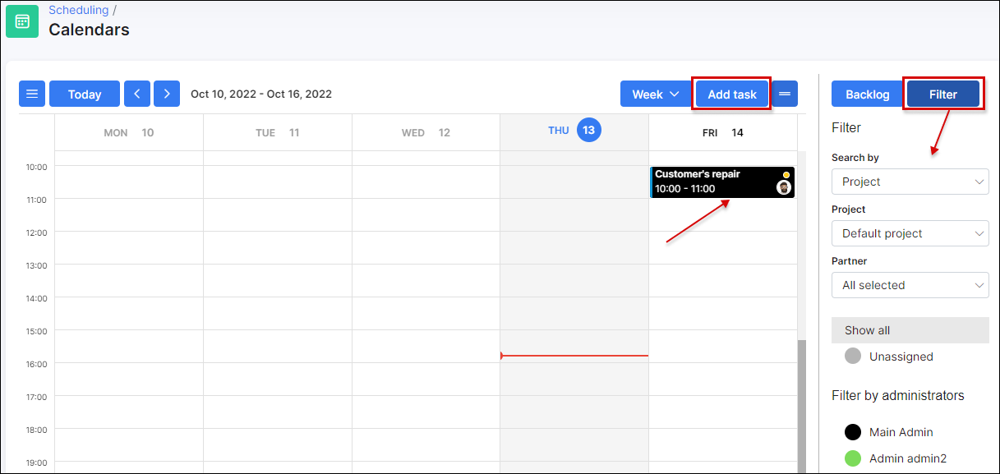

Calendars
=====

This is a calendar displaying all the project tasks and the relevant dates it was created, is due for or was completed.

The calendar view can be set to display the whole month, week or day.
The left side-bar filter allows to check the specific project or team tasks. It is also possible to set a custom colors for different tasks to make the use more convenient.

It is possible to edit task, change priority, status directly from the calendar. Simply click it and choose the needed option in the pop-up window.

