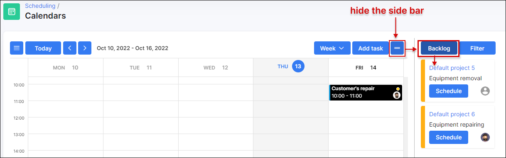

Calendars
=====

This is a calendar displaying all the project tasks and the relevant dates it was created, is due for or was completed.

The calendar view can be set to display the whole month, week or day.
The filter on the right allows you to check the specific project or team tasks, search by partner. It is also possible to set custom colors for different tasks to conveniently distinguish one from the other.

You can edit tasks, change their priority and status directly from the calendar. Simply click on a task and choose the option needed in the pop-up window.

