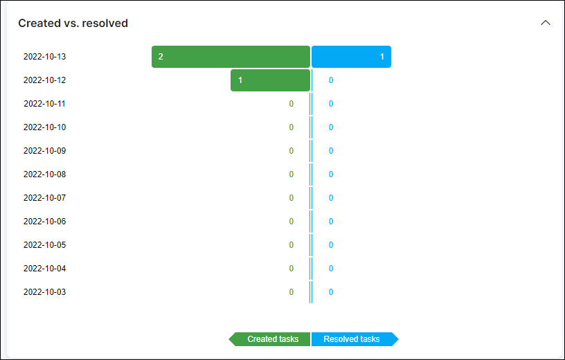

Scheduling Dashboard
=========
Our scheduling dashboard provides a convenient overview of all scheduling related data.

It is our centralized monitoring page to manage your scheduling module and quickly access your different sub-modules.

Here we can see our Tasks assigned to the current administrator, all tasks, activity within the scheduling module, some statistic of tasks created VS resolved tasks, links to *Splynx scheduling mobile app*.

My tasks
========
This table displays the tasks assigned to the administrator currently logged into the system. Displaying the priority in terms of an icon, an ID of the task itself, description of the task as well as the status of the task.

All Tasks (Assigned)
========
This is a table displaying tasks assigned to each specific administrator or team as well as unassigned tasks, conveniently displaying how many tasks are assigned to each administrator or team as well as the percentage of all tasks assigned to the respective admin/team.

Activity
========

Here we have a list of activities of all admins related to all tasks in the system. Displaying the history of each action taken by all admins for all tasks.

Created vs. Resolved
=====

This is a table representing statistical data of all tasks created against all tasks resolved providing a convenient way to track progress of all tasks.

Scheduling mobile application
=====
Splynx has developed a mobile task planner for your convenience. Now you don't need to enter Splynx all the time to work with your tasks. Just install the app on your mobile device and do the scheduling procedure more efficiently. All the changes will be automatically synchronized with your Splynx account.

The app is free to install from [App Store](https://apps.apple.com/app/splynx-scheduler-application/id1476053290) and [Google Play](https://play.google.com/store/apps/details?id=com.scheduling&hl=en).

