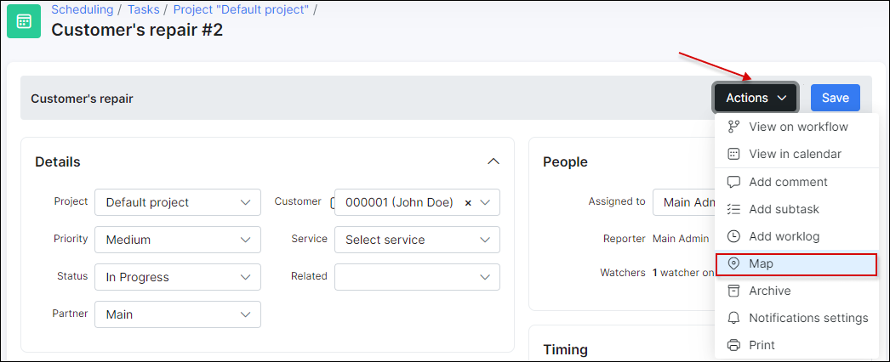
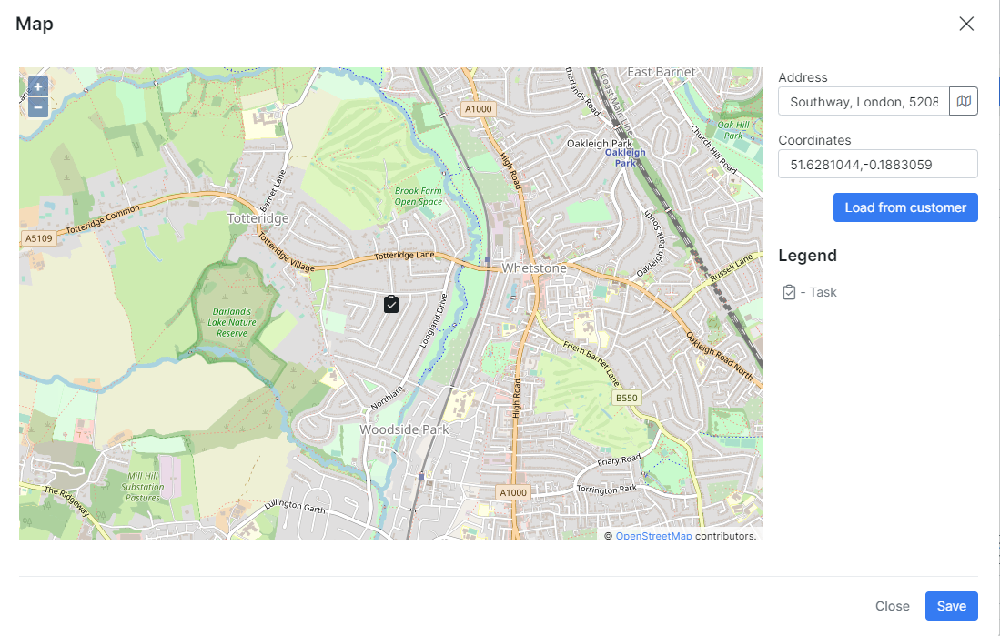
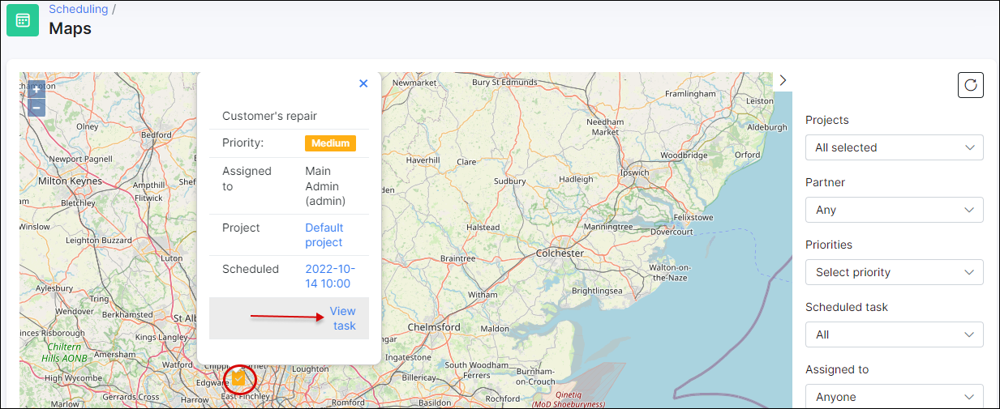

Maps
=====
To add a task on the map, open the task, and in ``Actions`` click on **Map**:

Then enter the address and/or coordinates or load the information from customer by clicking on ``Load from customer``:

In `Scheduling → Maps` you can find the map with the locations for each created task that have the exact GPS coordinates.

It is possible to filter the mapped tasks by **Projects**, **Partner**, **Priorities**, **Scheduled task**, **Assigned to**, **Creation date** or search it with the key words. If the filter is not applied, the map will show tasks created in the period: from 2 weeks ago to the current date.

All tasks have different legends according to their priority:

Tapping any task icon on the map displays brief information about the task. In the pop-up window, click the `View task` option to open the details of the specific task:

You might also be interested in the following tutorials:

- [How to create the task](scheduling/tasks/tasks.md)
- [Maps configuration](configuration/main_configuration/maps/maps.md)
