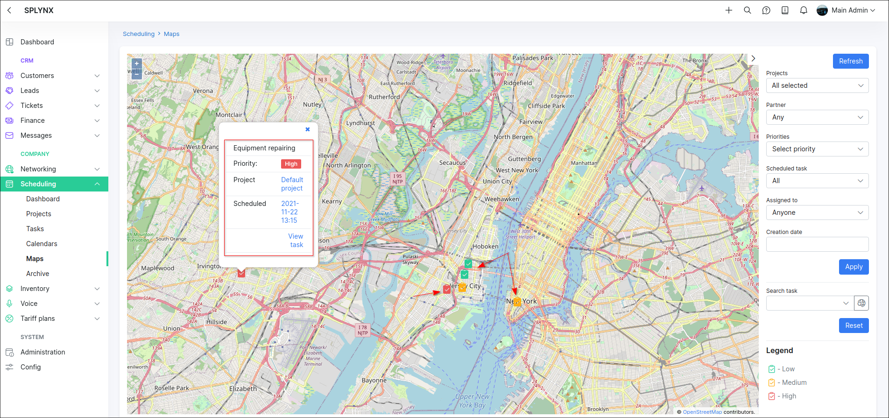

Maps
=====

Here you can find a map of all tasks that have physical addresses and geo data.

It is possible to filter the mapped tasks by partner, priority, assignee, time period, or scheduling.

By clicking the <icon class="image-icon"></icon> icon, brief info about the task will be displayed.
