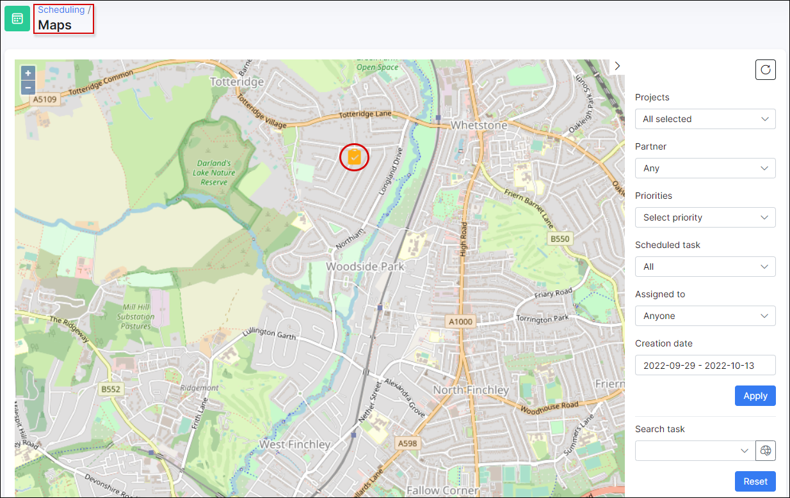

Maps
=====

In `Scheduling → Maps` you can find the map with the locations for each created tasks that have the exact GPS coordinates.

It is possible to filter the mapped tasks by **Project**, **Partner**, **Priorities**, **Scheduling status**, **Assignee**, **Creation date** or search it with the key words.

All tasks have different markers according to the priority.

Tapping any task icon on the map displays brief information about the task. In the pop-up window, click the `View task` option to open the details of the specific task.

You might also be interested in the following tutorials:

- [Maps configuration](configuration/main_configuration/maps/maps.md) ;
- [Google Maps API key](addons_modules/google_maps/google_maps.md).
