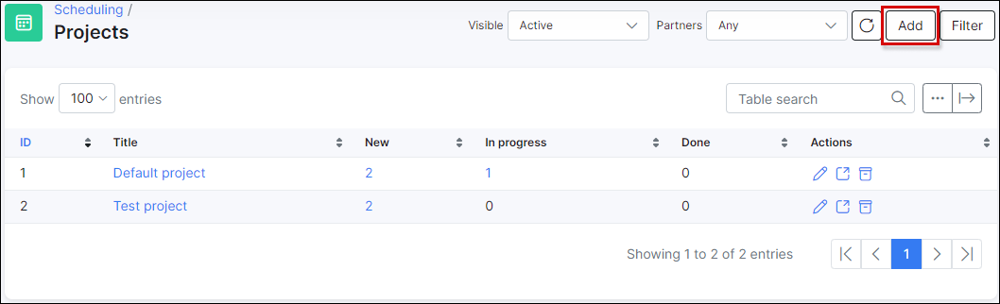
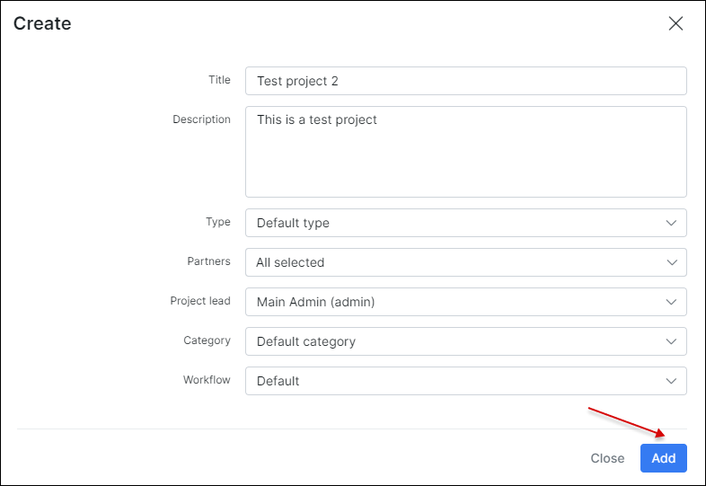
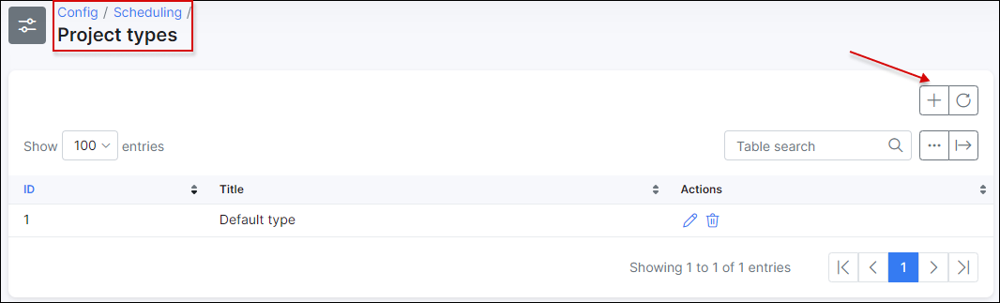
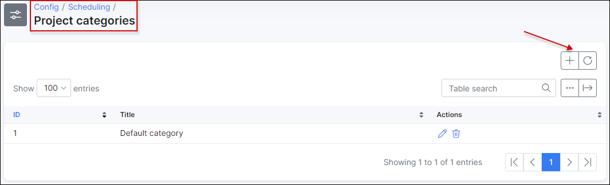
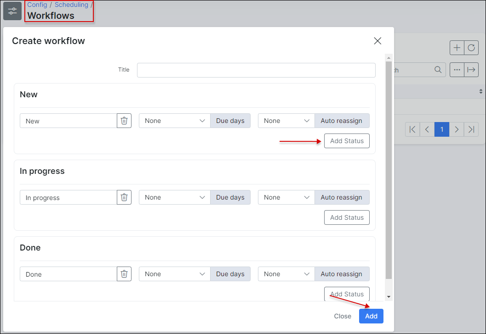

**Projects**

A new or existing project can be added/reviewed at `Scheduling > Projects`. To add a new project we need to press the **Add** button in the top right corner.

The new window will pop-up with a following options:

* **Title** - project name;
* **Description** - brief description of the project;
* **Type** - the project type, this is a custom option that can be created by administrator. The type can be created at `Config > Scheduling > Project types`;

* **Lead** - the lead of the project;
* **Category** - project categories, this is a custom option that can be created by administrator. The categories can be created at `Config > Scheduling > Project categories`;

* **Workflow** - the workflow for project tasks. This is a custom option that can be created/customized by administrator for different purposes. The workflows can be created at `Config > Scheduling > Workflows`;

Once the project is created we can edit it, create a project task, view the boards by using action icons <icon class="image-icon"></icon>.
