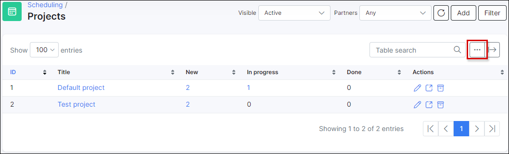
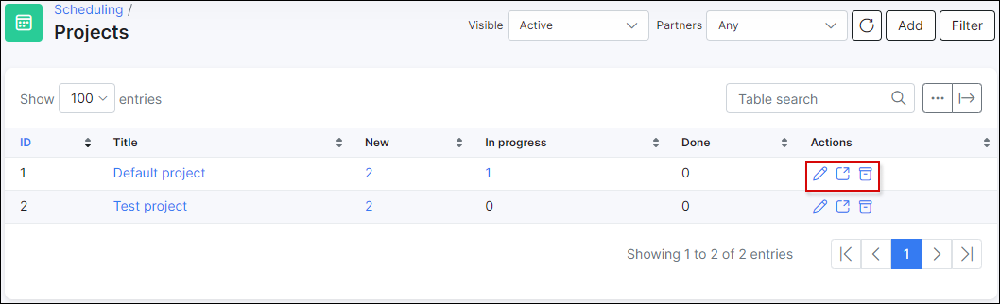

Projects
======
This is the main sub module of the scheduling displaying a list of all your projects at hand. Each project shows how many tasks it consists of,
how many tasks are in progress and the number of tasks already done for the project.

<icon class="image-icon"></icon> Just like all tables/lists in Splynx, the data displayed within them can be customized
to your preference by using the breadcrumbs icon at the top right of each list:

*********************************************************************************
### Creating a new project

A new or existing project can be added/viewed at `Scheduling → Projects`. To create a new project, press ``Add`` button at the top right corner.

A window will pop-up with the following options:

* **Title** - project name;
* **Description** - brief description of the project;
* **Type** - the project type, this is a custom option that can be created by an administrator. Project types can be created at `Config → Scheduling → Project types`:

* **Partners** - select a partner to associate the project with;
* **Project lead** - the lead admin of the project;
* **Category** - select a project category. This is a custom option that can be created by administrator. The categories can be created at `Config → Scheduling → Project categories`:

* **Workflow** - the workflow for project tasks. This is a custom option that can be created/customized by an administrator for different purposes. The workflow can be created at `Config → Scheduling → Workflows`:

***************************************
Once the project is created, you can edit it <icon class="image-icon"></icon>, view related tasks <icon class="image-icon"></icon> or [archive](scheduling/archive/archive.md) the project <icon class="image-icon"></icon>:

