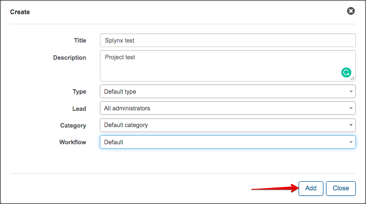
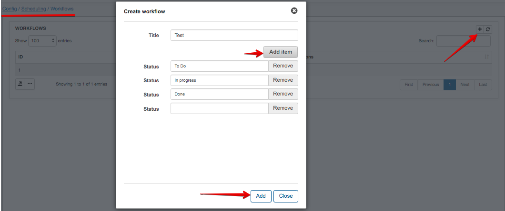
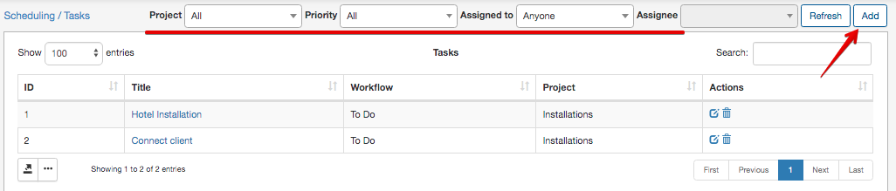
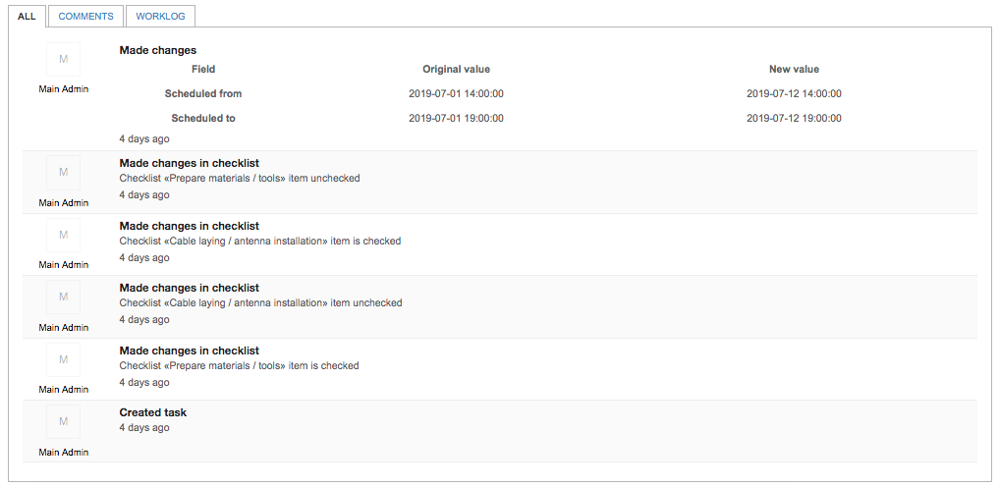
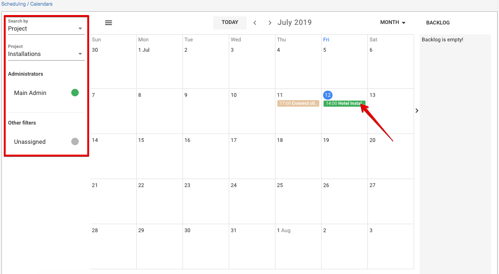
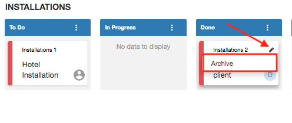
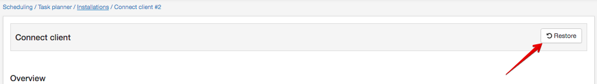

Scheduling
=======
Splynx scheduling feature was designed to optimize support and management processes of Internet Service Provides and simplify the work of technicians.

**Projects**

A new or existing project can be added/reviewed at `Scheduling > Projects`. To add a new project we need to press the **Add** button in the top right corner.

The new window will pop-up with a following options:

* **Title** - project name;
* **Description** - brief description of the project;
* **Type** - the project type, this is a custom option that can be created by administrator. The type can be created at `Config > Scheduling > Project types`;

* **Lead** - the lead of the project;
* **Category** - project categories, this is a custom option that can be created by administrator. The categories can be created at `Config > Scheduling > Project categories`;

* **Workflow** - the workflow for project tasks. This is a custom option that can be created/customized by administrator for different purposes. The workflows can be created at `Config > Scheduling > Workflows`;

Once the project is created we can edit it, create a project task, view the boards by using action icons <icon class="image-icon"></icon>.

----

**Tasks**

Every project has various tasks that we create and assign for responsible person. The tasks can be created by clicking the **Add** button in `Scheduling > Tasks`.

The existing tasks can be filtered by a specific project, priority or assignee.

It is also possible to create the task directly form the ticket you are working with by clicking the button **Create task** in the top right corner.

Once clicked, the new window will appear:

You might have various task templates to optimize the routine process of adding the task. It is possible to create own templates at `Config > Scheduling > Task templates`.  

*Create task window* includes:
* **Task template** - custom templates for quick task creation;
* **Title** - task name;
* **Description** - description of the task;
* **Project** - related project;
* **Assigned to** - the responsible person;
* **Related customer** - customer related to the task;
* **Priority** - low, medium, high;
* **Address** - physical address;
* **Geo data** - in case geo data is used, the task will be displayed on the map;
* **Is scheduled** - it is possible to set a scheduled time for the task;
* **Workflow** - your own workflow. Ex: to do, in progress, done, etc.
* **Checklist** - it is possible to use a custom checklist for various purposes like customer connection, new installation, etc.

Once the task has been created it is possible to edit it by clicking the Task name or by clicking the edit icon <icon class="image-icon"></icon> .  

It is possible to edit task overview, to mark the checklist steps, to log the time spent, edit task description, re-schedule the task or simply check the activity log.

Every task has action buttons that allows you to:  

* To add the comment
* To log the time spent
* To place the task on the map
* To check the task board
* To review the task in your calendar
* To archive the task

Another feature that optimizes you work with tasks is an action log window that is displayed at the bottom. It allows you to track all the activities that were performed, check the worklog and task comments.

  

----

**Calendars** - `Scheduling > Calendars`

All the project tasks will be displayed in your calendar.

The calendar view can be set to display the whole month, week or day.
The left side-bar filter allows to check the specific project or team tasks. It is also possible to set a custom colors for different tasks to make the use more convenient.

It is possible to edit task, change priority, status directly from the calendar. Simply click it and choose the needed option in the pop-up window.

----

**Boards** - `Scheduling > Boards`

Boards allow you to oversee the project tasks and progress with a visual board interface.

You can change the task status by dragging it to the needed position. To open the task simply click it.

----

**Maps** - `Scheduling > Maps`

All the task with the physical address and geo data will be displayed on the map.

It is possible to filter the mapped tasks by partner, priority, assignee, time period, or scheduling.

By clicking <icon class="image-icon"></icon> icon the brief info about the task will be displayed.

----

**Archive**  - `Scheduling > Archive`

Completed task can be moved to Achive from the boards or by using the **Actions** button in task window.

You can always restore the task from the archive in case of necessity. Just click on **Restore** button in the needed task window.

