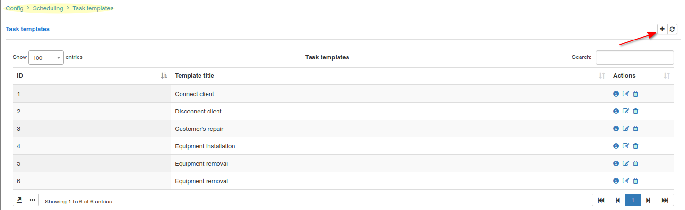
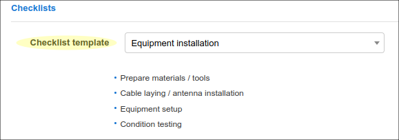

Tasks
======

Every project has various tasks that we create and assign to a specific administrator. Tasks can be created by clicking the **Add** button in `Scheduling > Tasks`.

The existing tasks can be filtered by a specific project, priority or assignee.

It is also possible to create the tasks directly from the ticket you are working with by clicking the **Create task** button in the top right corner of the page.

Once clicked, the new window will appear:

It is possible to have various task templates to optimize the routine/process of adding new tasks. You can create your own templates at `Config > Scheduling > Task templates`.  

*Create task window* includes:
* **Task template** - the custom templates for quick task creation;
* **Title** - the task name;
* **Description** - the description of the task;
* **Customer** - the customer related to the task (id and customer full name);
* **Related service** - the Internet service linked to customer;
* **Partner** - the partner for which the customer belong to;
* **Project** - related project;
* **Location** - the customer's location;
* **Assignee** - the responsible person;
* **Priority** - the options: low, medium, high;
* **Address** - the physical customer address;
* **Geo data** - in case the geo data is used, the task will be displayed on the map;
* **Enable notifications** - enable notification for the current ticket;
* **Is scheduled** - it is possible to set a scheduled date and time for the task (an estimated time can be specified);
* **Workflow** - your own workflow. Ex: to do, in progress, done, etc.
* **Checklist** - it is possible to use a custom checklist template for various purposes like *Connect client*, *Equipment installation*, *Customer's repair* etc.
* **Attachments** - the option to add file(s)/archive(s) to the ticket;

Once the task has been created it is possible to edit it by clicking the Task name or by clicking the edit icon <icon class="image-icon"></icon> .  

It is possible to download all attachments, to mark the checklist steps, to log the time spent (the worklog), edit task description, re-schedule the task or simply check the activity log, etc.

Every task has action buttons that allows you to:  

* To add the comment
* To add sub-task
* To log the time spent (worklog)
* To place the task on the map
* To check the task board/workflow
* To review the task in your calendar
* To archive the task
* To edit notification settings
* To print the current ticket

Another feature that optimizes you functionality with tasks is an action log  that is located at the bottom of the tasks window. It allows you to track all the activities that were performed within the task, check the worklog and task comments.

  
