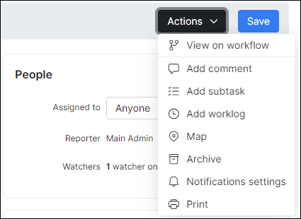

Tasks
======

Every project has various tasks that we create and assign to a specific administrator. Tasks can be created by clicking the **Add** button in `Scheduling > Tasks`.

The existing tasks can be filtered by a specific project, priority or assignee.

It is also possible to create the tasks directly from the ticket you are working with by clicking the **Create task** button in the top right corner of the page.

Once clicked, the new window will appear:

It is possible to have various task templates to optimize the routine/process of adding new tasks. You can create your own templates at `Config > Scheduling > Task templates`.  

*Create task window* includes:
* **Task template** - custom templates for quick task creation;
* **Title** - task name;
* **Description** - description of the task;
* **Project** - related project;
* **Assigned to** - the responsible person;
* **Related customer** - customer related to the task;
* **Priority** - low, medium, high;
* **Address** - physical address;
* **Geo data** - in case geo data is used, the task will be displayed on the map;
* **Is scheduled** - it is possible to set a scheduled time for the task;
* **Workflow** - your own workflow. Ex: to do, in progress, done, etc.
* **Checklist** - it is possible to use a custom checklist for various purposes like customer connection, new installation, etc.

Once the task has been created it is possible to edit it by clicking the Task name or by clicking the edit icon <icon class="image-icon"></icon> .  

It is possible to edit task overview, to mark the checklist steps, to log the time spent, edit task description, re-schedule the task or simply check the activity log.

Every task has action buttons that allows you to:  

* To add the comment
* To log the time spent
* To place the task on the map
* To check the task board
* To review the task in your calendar
* To archive the task

Another feature that optimizes you functionality with tasks is an action log  that is located at the bottom of the tasks window. It allows you to track all the activities that were performed within the task, check the worklog and task comments.

  
