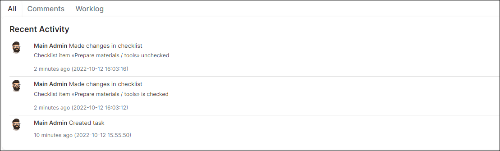

Tasks
======

Every project has various tasks that we create and assign to a specific administrator. Tasks can be created by clicking ``Add`` button in `Scheduling → Tasks`.

The existing tasks can be searched by *Project*, *Stage* or *Partners*.

You can also apply an advanced search with `Filter` button located at the top right corner of the Tasks window. With this feature, tasks can be filtered by *Period*, *Customer/Lead*, *Task ID*, *Priority*, *Assignee*, *Location* or any *Text* in tasks.

With these buttons <icon class="image-icon"></icon>, you can watch tasks in *Table view* or [*Workflow*](scheduling/workflow/workflow.md):

It is also possible to create tasks directly from the ticket you are working with by clicking on ``Actions`` button at the top right corner of the page, and then on **Create task**:

Once clicked, a new window appears:

*Create task window* includes:
### Main info:
* **Task template** - custom templates for quick task creation;
* **Title** - task name;
* **Description** - description of the task. Here you can apply styles, add links and images, etc.;
* **Customer** - customer related to the task;
* **Related services** *(this field appears if you chose a customer)* - customer's services related to the task;
* **Partner** - you can select a partner or leave *Main*;
* **Project** - related project;
* **Assigned to** - the responsible person;
* **Priority** - low, medium, high;
* **Address** - physical address;
* **Geo data** - in case geo data is used, the task will be displayed on the map;
* **Enable notifications** - it is possible to receive notifications about the task;
* **Schedule** - if enabled, you can set date, time and number of hours for completing the task.
### Workflow:
* **Status** - your own workflow. Ex: to do, in progress, done, etc.
### Checklists:
* **Checklist template** - it is possible to use a custom checklist for various purposes like customer connection, new installation, etc.
### Attachments:
By clicking on ``Upload``, you can attach files related to the task.
**********************************

It is possible to have various task templates to optimize the routine/process of adding new tasks. You can create your own templates in *Config → Scheduling → Task templates* or choose from the existing ones:  

***********************************
Once the task has been created it is possible to edit it by clicking the Task name or by clicking the edit icon <icon class="image-icon"></icon> .  

It is possible to edit task overview, mark checklist steps, log the time spent, edit task description, add related tasks, re-schedule the task, add responsible people or simply check the activity log.

Every task has action buttons that allow you the following:

* View on [workflow](scheduling/workflow/workflow.md)
* Add comments
* Add subtasks
* Log the time spent
* Place the task on the map
* Archive the task
* Set notifications
* Print the task information

If you create **a subtask**, it will be marked in the task list with the following sign:

The subtask will be also shown inside the parent task:

If you remove the parent task, its subtask remains in the task list but it is no longer a subtask.
***************************************************************

Another feature that optimizes your functionality with tasks is an action log  that is located at the bottom of the tasks window. It allows you to track all the activities that were performed within the task, check the worklog and task comments.

  
