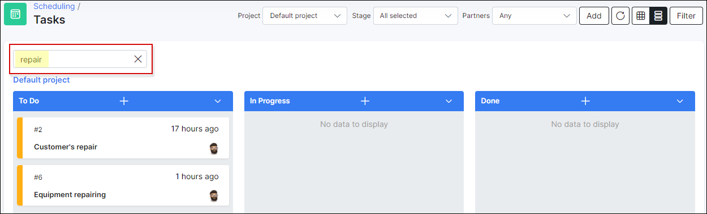

Workflow
=======
To open the workflow mode, click on the following button at the top right corner of the tasks list:


<icon class="image-icon"></icon> 
It is possible to view the workflow only if a project is selected:


*Workflow* allows you to control project tasks and progress with a visual board interface.

You can change each task's status by dragging it to the needed position on the board and conveniently open any task by simply clicking on it.


It is possible to add new tasks in any desired stage of the workflow with the ```+``` icon.


You can also archive tasks, modify the sorting of tasks or move tasks with the arrow icon:


It is also possible to archive a separate task by clicking on <icon class="image-icon"></icon> button at the top right corner of each task (the button appears when you are hovering over the top right corner of the task card):


**Board search** field allows you to search for tasks by a common word in them:


**********************************************************
<icon class="image-icon"></icon> To configure a custom workflow, navigate to *Config → Scheduling → Workflows*.
Please read [this article](configuration/scheduling/workflow/workflow.md) to learn more about the workflow configuration.