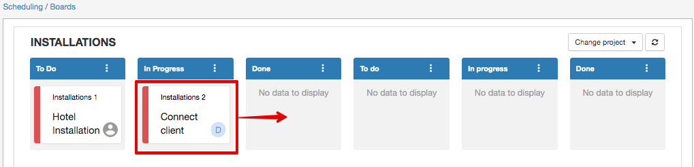

Workflows
=======

Workflows allow you to oversee the project tasks and progress with a visual board interface.

You can change each task's status by dragging it to the needed position on the board and conveniently open any task by simply clicking it.
