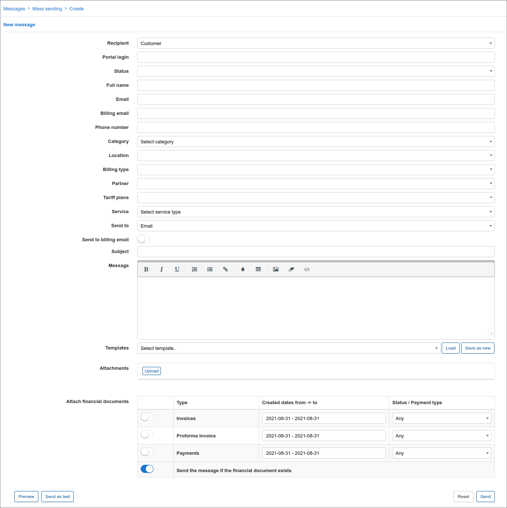
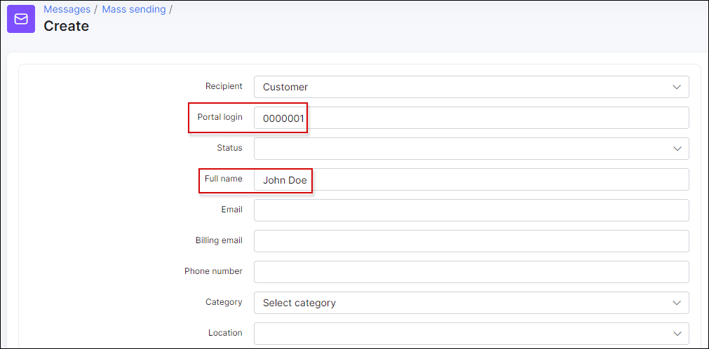
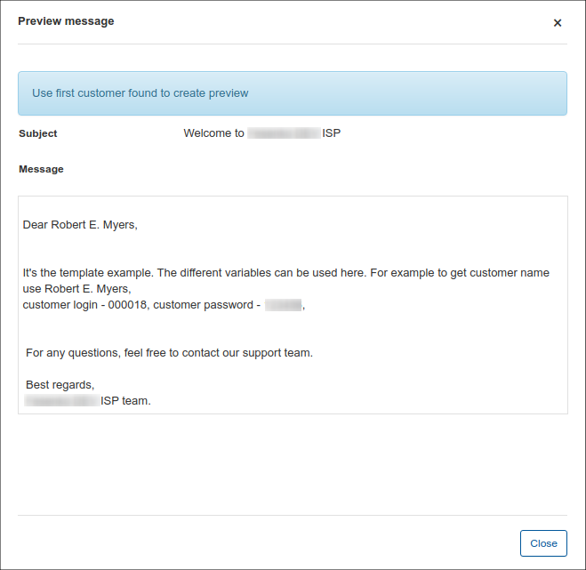
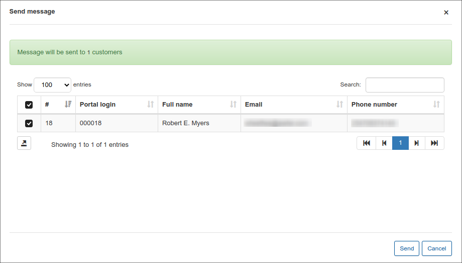
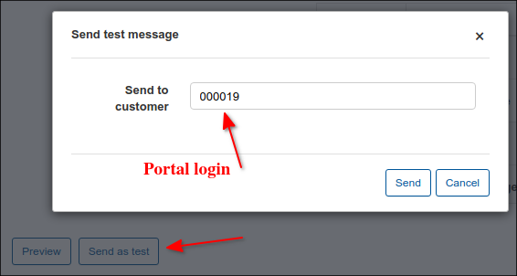
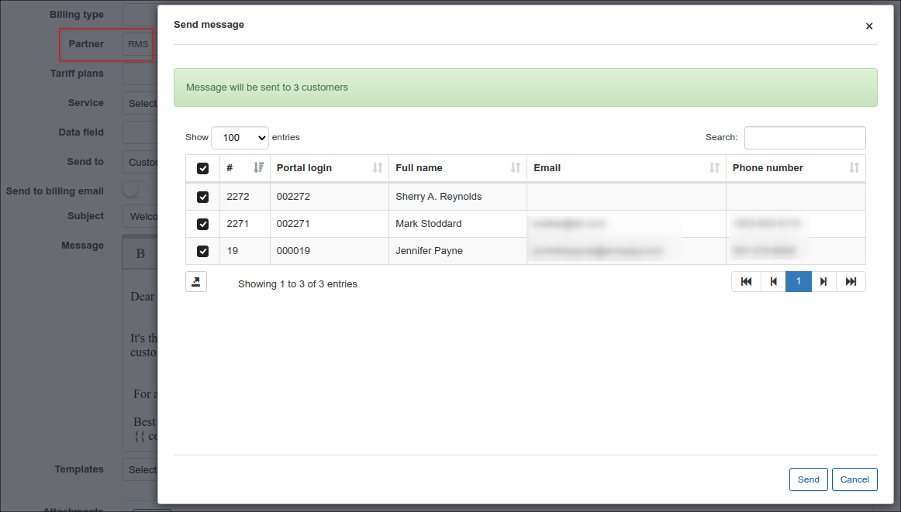
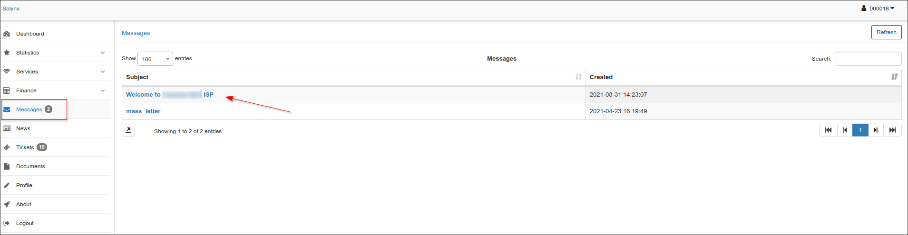
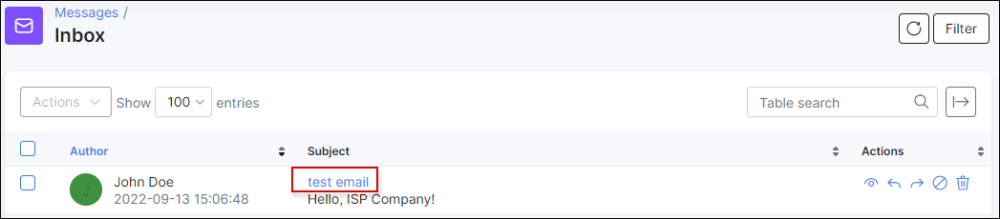
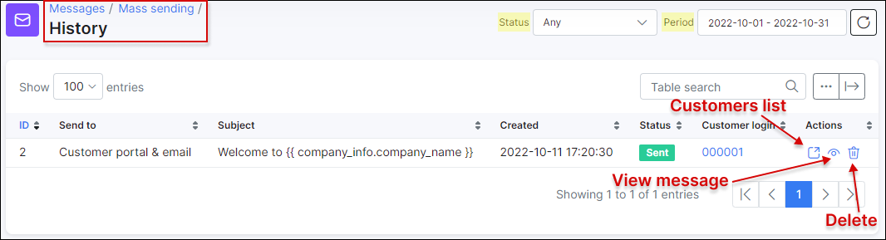
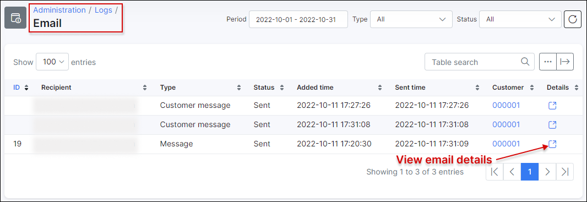

Email messages
==============

The messages option in `Support → Messages` allows you to send an email to the customer(s) directly from Splynx using different templates and attaching financial or other documents.

It is necessary to configure email first in `Config → Main Configuration → Mail` before sending email to the customer. More information about email configuration can be found in - [Email config](configuration/main_configuration/email_config/email_config.md).

**To create an email** click on Create in `Support → Messages`, a window will appear with the following fields:  

* **ID** - ID of the customer. It has given by the system in a sequential order

* **Login** - user login

* **Status** - there are New, Active, Inactive, Blocked statuses of the customer

* **Type of billing** - Recurring payments or Prepaid options

* **Full name** - full name of the customer

* **Email** - email of the customer

* **Phone number** - phone number of the customer

* **Date added** - date customer was added

* **Category** -  could be Private person or Company

* **Partner** - partner, service provider of the customer

* **Location** - location of the customer

* **Tariff plans** - all available tariff plans in Internet, Voice, Custom services

* **Service** - Internet service, Voice service and Custom service

* **Send to** - the options are: Email, Customer portal, Customer portal & Email, SMS

* **Subject** - Subject of the email

* **Message** - Body of the message

* **Templates** - Templates of Customer portal and Mail templates can be used.

* **Attachments** - individual attachments

* **Attach financial documents** - Invoices, Proforma Invoices and Payments from Splynx.

It is not necessary to fill in all fields to send an email to the customer. The easiest way is to enter a customer's ID, choose the "Send to" option, type a Subject and write a message.
 You can choose a message body from templates or write particular text to populate the body of the message. You can also type your own message and save it as a new template by clicking on "Save as new". There is also an option to attach financial documents of the customer (invoices, proforma invoices and payments receipts).

You can view your messages before sending it by clicking on the Preview option at the bottom of the page.

When you click on the Send button, a window will appear with the confirmation details of the recipient.

If you click on Send as test, a window will appear where the customer's ID has to be entered.

There is also an option of mass sending, for example, you can choose particular recipients by Partner or Location.

If you choose the sending option as Send to Customer portal or Customer Portal & email, customers will be able to read the email in their portal in the Messages section, where all incoming emails will be shown.

By clicking on *View* <icon class="image-icon"></icon> the email will appear with the attachment enclosed.

It is possible to track all emails that were sent in Splynx by navigating to `Support → Messages → History`. You can sort all items by their status (Any, New, Processing, Sent, Cancelled, Removed, Sent with error) or a period of time (Today, Yesterday, Last 7 days, This month, Last month, Custom Range).

By clicking on the actions buttons <icon class="image-icon"></icon>, you'll be able to see the list customers' (in case of mass sending it will be a full list with customers' names), view the email or delete it.

It is also possible to check all recipients list by their IDs and Email addresses in `Administration → Logs → Email`, where you can set a particular period, type of email message or status.

