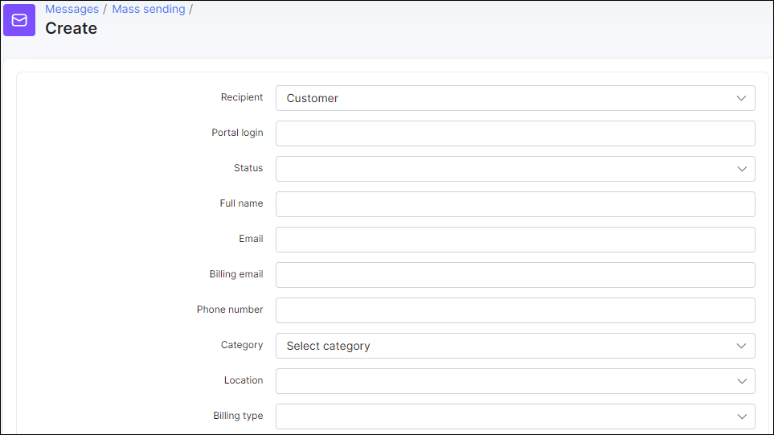
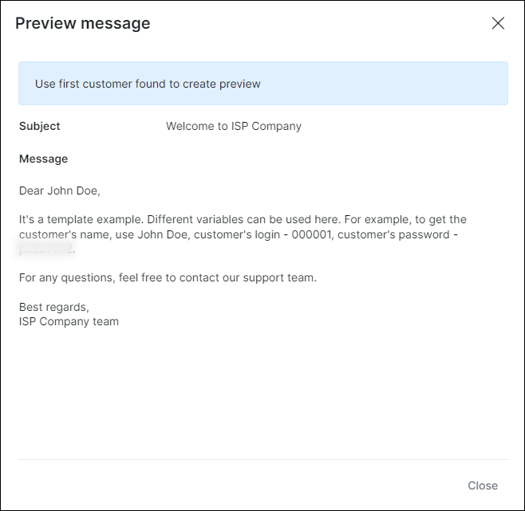
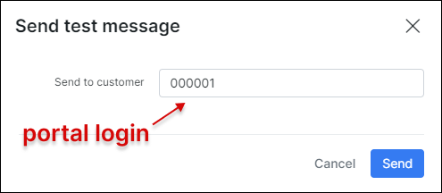

Mass sending
==============

The messages option in `Messages → Mass sending → Create` allows you to send an email to the customer (-s) directly from Splynx using different templates and attaching financial or other documents.

It is necessary to configure SMTP first in `Config → Main → Email` before sending email to the customer. More information about email configuration can be found in - [Email config](configuration/main_configuration/email_config/email_config.md).

**To create a new message** click on `Create` in `Messages → Mass sending`, a window will appear with the following fields:  

* **Recipient** - to select who receives the message: *Customer* or *Lead*;

* **Portal login** - the login that customer uses to login to [Portal](customer_portal/customer_portal.md), e.g. `000040`;

* **Status** - there are *New*, *Active*, *Inactive*, *Blocked* statuses of the customer and it's possible to *Select all*;

* **Full name** - full name of the customer;

* **Email** - email address of the customer;

* **Billing email** - email address of the customer for the billing correspondence;

* **Phone number** - phone number of the customer;

* **Category** -  could be `Individual` person or `Business`;

* **Location** - [location](administration/main/locations/locations.md) of the customer;

* **Billing type** - *Recurring*, *Prepaid (Custom)* or *Prepaid (Daily)*;

* **Partner** - [partner](administration/main/partners/partners.md), service provider of the customer

* **Tariff plans** - all available tariff plans in *Internet*, *Voice*, *Recurring*, *Bundles* categories;

* **Service** - type of service: *Bundles*, *Internet*, *Voice*, *Recurring*;

* **Send to** - the options are: *Email*, *Customer portal*, *Customer portal & email*, *SMS*;

* **Send to billing email** - toggle enables/disables to send message to customer's *Billing email*;

* **Subject** - subject of the email;

* **Message** - body of the message;

* **Templates** - [templates](configuration/system/templates/templates.md) of *Email*, *SMS*, *Customer portal* can be used;

* **Attachments** - file (-s) sent along with a message;

* **Attach financial documents** - *Invoices*, *Proforma Invoices* and *Payments* from Splynx.

You don't have to fill out all the fields to send an email to a customer. The easiest way is to enter a customer's **Portal login** or **Full name**, choose the **Send to** option, type a **Subject** and write a message.

You can choose a message body from templates or write particular text to populate the body of the message. You can also type your own message and save it as a new template by clicking on `Save as new` button or load the existing one. There is also an option to attach customer's financial documents.

You can view your message before sending it by clicking on the `Preview` button at the bottom of the page.

When you click on the `Send` button, a window will appear with the confirmation details of the recipient.

If you click on `Send as test` button, a window will appear where the customer's **Portal login** has to be entered.

There is also an option of mass sending, for example, you can choose particular recipients by **Partner** or **Location**.

If you choose the sending option as **Send to** `Customer portal` or `Customer portal & email`, customers will be able to read the email in their portal in the **Messages** section, where all incoming emails will be shown.

Click on the subject to open the message

It is possible to track all emails that were sent in Splynx by navigating to `Messages → Mass sending → History`. You can sort all items by their **status** (*Any, New, Processing, Sent, Cancelled, Removed, Sent with error*) or by **period** of time (*Today, Yesterday, Last 7 days, Last 30 Days, This month, Last month, Custom Range*).

By clicking on the actions buttons <icon class="image-icon"></icon>, you'll be able to see the list customers, view the email or delete it.

It is also possible to check all recipients list by their **IDs** and **Email** addresses in `Administration → Logs → Email`, where you can set a particular **period**, **type** of email message or its **status**.

