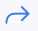

Inbox
==============

**NOTE:** To use the **Inbox** feature it's **required** to make [Personal IMAP / SMTP configuration](my_profile/imap/imap.md) in `My Profile → IMAP (tab)`.

If you plan to use **global SMTP** in Splynx, please configure it in `Config → Main → Email` and enable **Use system SMTP** option in `My Profile → IMAP (tab)`.

The **Inbox** feature in `Messages → Inbox` allows you to add your personal email address into Splynx in order to simplify communication with potential or existing customers. It would be like a simple [mail client](https://en.wikipedia.org/wiki/Email_client) with a configured mail box via IMAP.

|   |   |
| ------------ | ------------ |
| <icon class="image-icon"></icon>  | **View message**. The option is used to open message in the new window.|
| <icon class="image-icon"></icon>  | **Reply**. The option is available only if the customer/lead with such email address exists in Splynx. After you press *Reply* sign, you will be redirected to **Communication** tab of customer/lead profile|
| <icon class="image-icon"></icon>  | **Forward**. The option is available only if the customer/lead with such email address exists in Splynx. After you press *Forward* sign, you will be redirected to **Communication** tab of customer/lead profile |
| <icon class="image-icon"></icon>  | **Block email** . The email address will be added to **Deny list** in `My Profile → IMAP (tab)` The next newly emails from this address won't be visible in Splynx `Inbox`|
| <icon class="image-icon"></icon>  | **Delete message**  The option to remove message.|
| <icon class="image-icon"></icon>  | **Pair to customer/lead**. After you press *Pair to customer/lead* sign and select related account, the email address will be added to `Email` field of this account. |
| <icon class="image-icon"></icon>  | **Add customer/lead**. Using this option, the new customer/lead account can be created in Splynx|
| <icon class="image-icon"></icon>  | This lable will be preset in the subject of the message if customer/lead email address is not related to any customer/lead account in Splynx. Only in such messages the *Pair to customer/lead* and *Add customer/lead* actions can be applied. |
| <icon class="image-icon"></icon>  | The **Advanced search** icon is located in the top right corner of the table and can be used to search messages by **period** or by some **text**. |

With the help of the export <icon class="image-icon"></icon> icon at the bottom left corner of the page you can print or copy the list of the inbox messages or choose to save file in a selected format.
