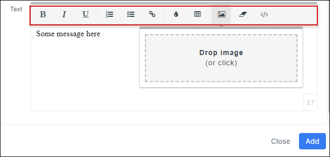
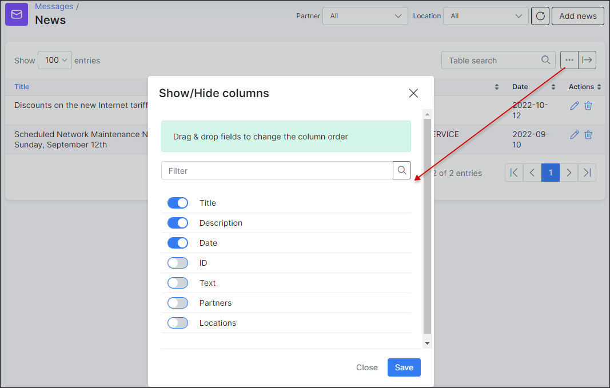

News
====

The news feature will help you provide your customers with updated information about services or some business aspects of your company.

**To create News** go to *Support → News* and click on *Add News* on the top right of the table.

When clicking on"*Create news*", a window will appear where you will be able to fill in a Title and a Description in the provided fields, choose the correct date, select Partners and location if necessary, and type text relative to the news you wish to deliver.

The editing option of the text allows you to edit or format the text, insert URL links and images.

For example, you can insert a URL link to redirect customers to your company's website to get more information about the particular topic. To do so, you simply need to highlight the word or phrase, which will be linked to a webpage, click on <icon class="image-icon"></icon> icon in the edition field under the text and enter the URL. Then simply submit and save it.

After newsletters are created it is  possible **to edit or delete them** with the <icon class="image-icon"></icon> icons in Actions column.

It is also possible **to sort the news** by the Partner or Location.

With the help of the export icon <icon class="image-icon"></icon> at the bottom left of the table you can print or copy the list of the news or save it in PDF or SCV format. By clicking on the breadcrumbs icon <icon class="image-icon"></icon> you are able to choose columns to be displayed in the news table by enabling/disabling the provided fields and to sort the table, simply drag & drop the fields in the desired sequence.

Customers will be able to see the news in the Customers Portal on their *Dashboard*. By clicking on the *Title* of the newsletter they can  view/read it and by clicking on the interactive link they will be redirected to a webpage if a URL is was set.

It is important to enable the option to *Show portal news* in *Config → Portal → Dashboard* in Splynx, for customers to be able to see the news within their portal.

