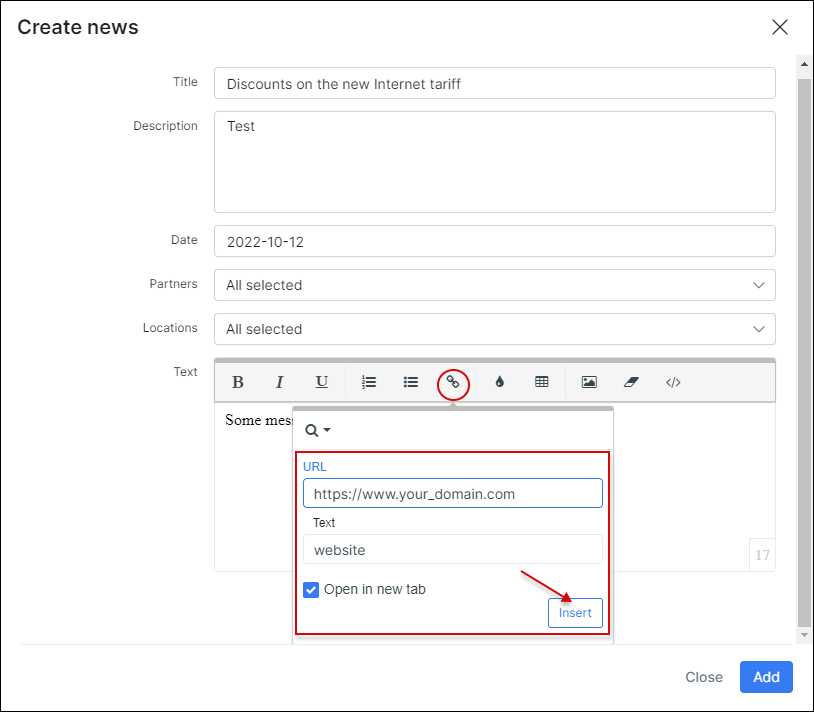
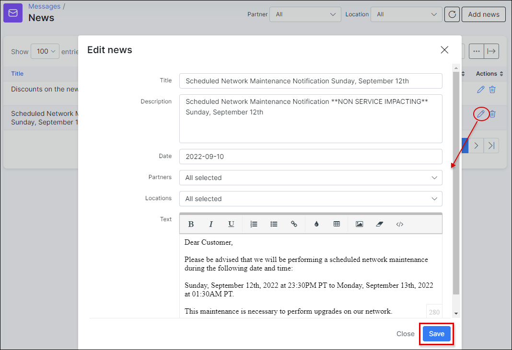

News
====

The news feature will help you provide your customers with updated information about services or some business aspects of your company.

**To create News** go to `Messages → News` and click on **Add news** on the top right corner of the table.

When you click on **Add news** button, a window will appear where you will be able to fill in a **title**, **description** in the provided fields, to choose the correct **date**, select **partners** and **location** if necessary, and type **text** relative to the news you wish to deliver.

The editing options of the text allow you to edit or format the text, insert URL links and images.

For example, you can insert a URL link to redirect customers to your company website to get more information about the particular topic. To do so, you simply need to highlight the word or phrase, which will be linked to a web page, click on <icon class="image-icon"></icon> icon in the edition field under the text and enter the URL, then simply press `Insert` button.

After newsletters are created it is possible to **edit** or **delete** them with the <icon class="image-icon"></icon> icons in **Actions** column.

It is also possible to **sort the news** by the **Partner** or by the **Location**.

With the help of the export icon <icon class="image-icon"></icon> at the bottom left corner of the table you can print or copy the list of the news or save it in the preferred file. By clicking on the breadcrumbs icon <icon class="image-icon"></icon> you are able to choose columns to be displayed in the news table by enabling/disabling the provided fields and to sort the table, simply drag & drop the fields in the desired sequence.

Customers will be able to see the news in the [Customers Portal](customer_portal/customer_portal.md) on its **Dashboard**. By clicking on the *Title* of the newsletter they can  view/read it and by clicking on the interactive link in the text they will be redirected to a webpage if a URL is set.

It is important to enable the option to `Show portal news` in `Config → Main → Portal → PER PARTNER SETTINGS (tab) → Dashboard` of Splynx, for customers to be able to see the news within their *Portal*.

