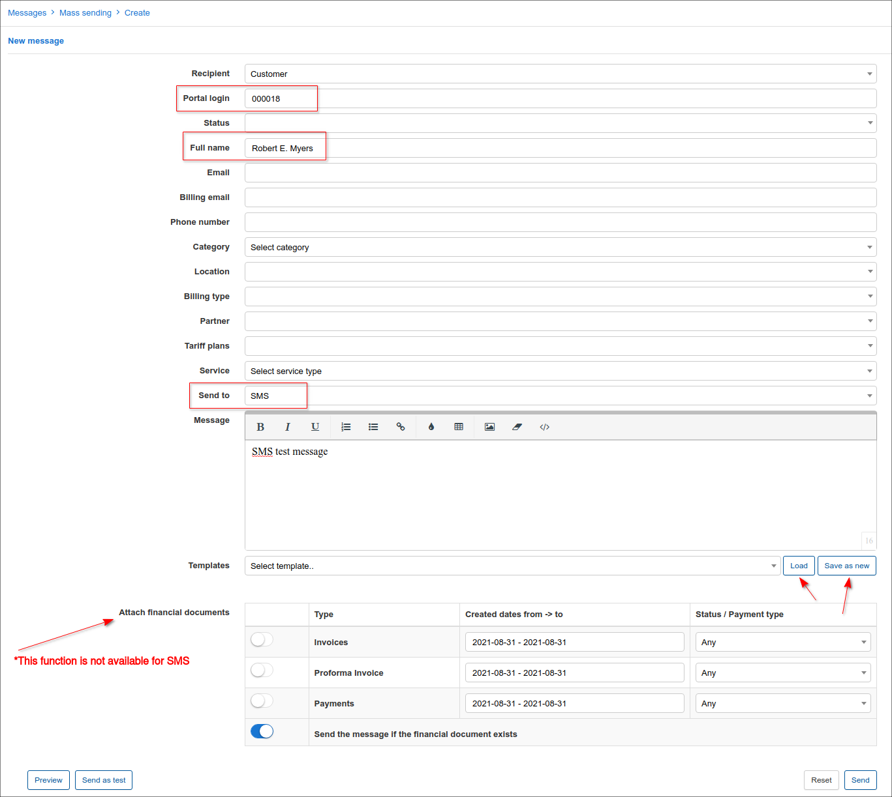
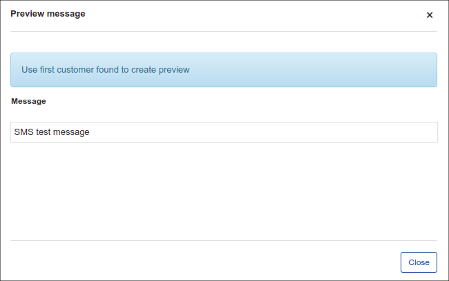
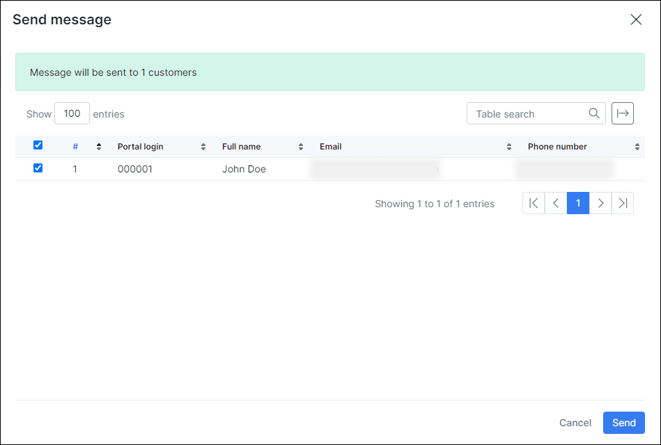
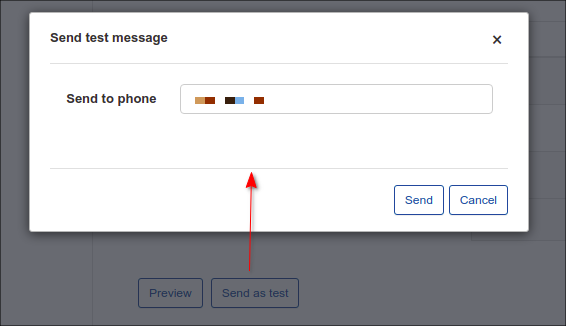
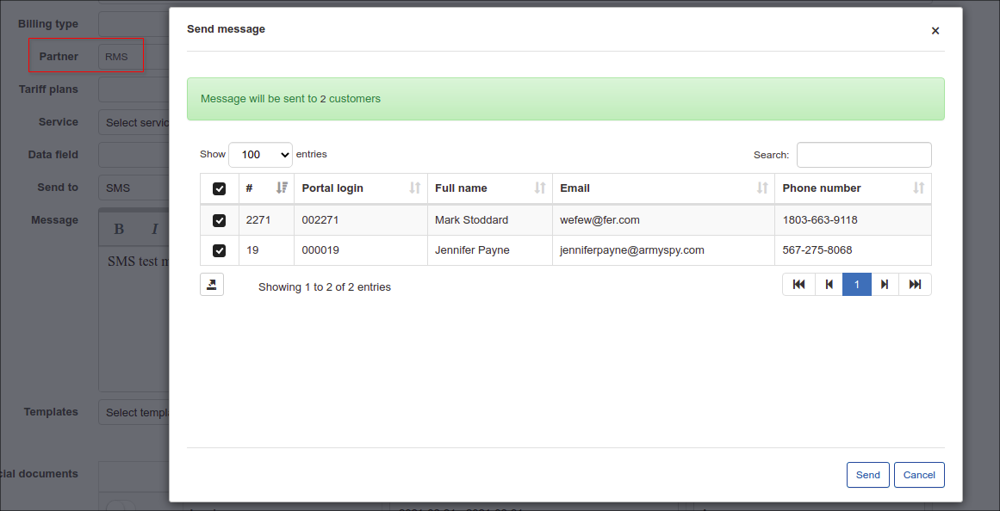
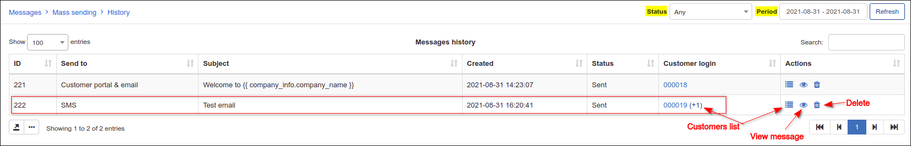
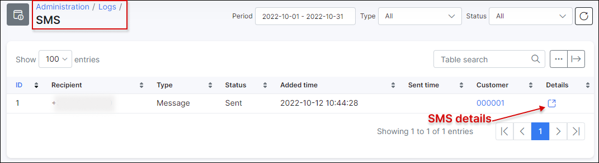

SMS messages
============

To send messages via BulkSMS service (bulksms.com, bulksms.co.za), please configure the following values:

URL:
[https://bulksms.2way.co.za/eapi/submission/send_sms/2/2.0](https://bulksms.2way.co.za/eapi/submission/send_sms/2/2.0)

POST:
username=&password=&message=%MESSAGE%&msisdn=%TO%&concat_text_sms_max_parts=4

and you will get a successful response:
0|IN_PROGRESS|

It is necessary to configure SMS first in `Config → Main Configuration → SMS` before sending SMS to the customer. More information about SMS configuration can be found on our tutorial page - [SMS config](configuration/main_configuration/sms_config/sms_config.md).

To create an SMS click on **Create** in `Support → Messages`. The window will pop-up with the following fields:  

* **ID** - ID of the customer. It has given by the system in a sequential order.

* **Login** - user login

* **Status** - there are New, Active, Inactive, Blocked statuses of the customer

* **Type of billing** - Recurring payments or Prepaid options

* **Full name** - full name of the customer

* **Email** - email of the customer

* **Phone number** - phone number of the customer

* **Date added** - date customer was added

* **Category** -  could be Private person or Company

* **Partner** - partner, service provider of the customer

* **Location** - location of the customer

* **Tariff plans** - all available tariff plans from Internet, Voice, Custom services

* **Service** - Internet service, Voice service and Custom service

* **Send to** - the options are: Email, Customer portal, Customer portal &  Email, SMS

* **Message** - Body of the message

* **Templates** - Templates of Customer portal and Mail  templates can be used.

* **Attachments** - individual attachments

* **Attach financial documents** - Invoices, Proforma Invoices and Payments from Splynx.

It is not necessary to fill in all the fields to send SMS to the customer. The easiest way is to enter customer's 'ID', choose option 'Send to' and write a SMS message. You can choose a body message from templates or write particular text. You can also write your own message and save it as a new template by clicking on Save as new.

You can check your SMS message before sending by clicking on the Preview option at the bottom of the page.

When you click on the Send button, a window will appear with the confirmation details of the recipient.

If you click on 'Send as test'  a window will appear where customer's Phone number has to be entered.

There is an option to send mass SMS's, for example, you can choose particular recipients by Partner or Location.

All SMS's and emails that were sent on the system are displayed in Support → Messages → History. You can sort them by their status (Any, New, Processing, Sent, Cancelled, Removed, Sent with error) or a period of time (Today, yesterday, Last 7 days, This month, Last month, Custom Range).

By clicking on actions <icon class="image-icon"></icon> you'll be able to see the list of customers' (in case of SMS mass sending it will be a full list with customers' names), view SMS messages and delete it.

It is also possible to check the recipients list by their IDs and Phone numbers in Administration → Logs → SMS, where you can set a particular period, type of SMS or status (New, Sending, Sent, Error, Expired).

