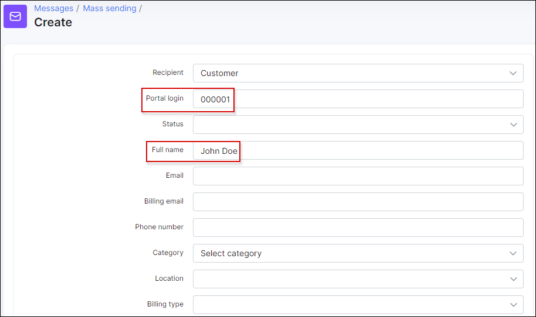
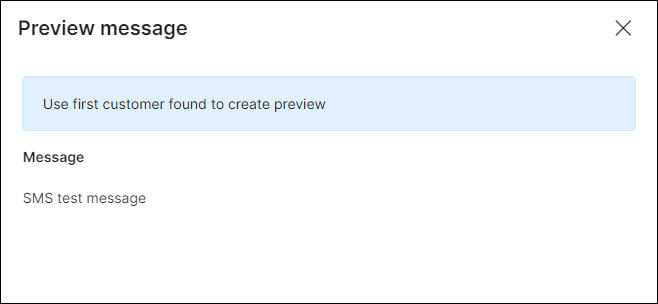
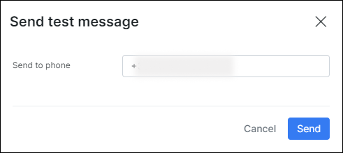
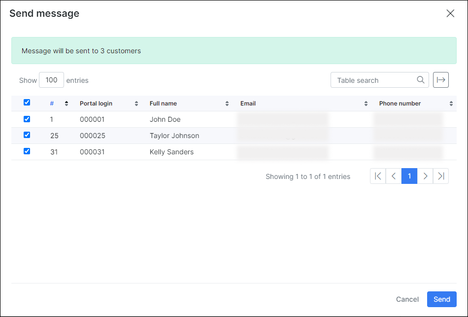
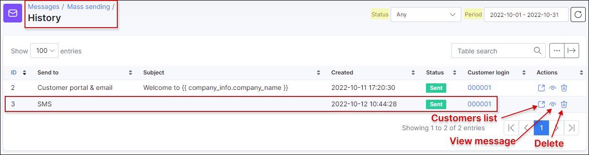

SMS messages
============

Before sending the SMS messages to customer (-s), it's necessary to configure SMS first in `Config → Main Configuration → SMS`. For example, you can use [BulkSMS](https://www.bulksms.com/countries/s/south-africa), [Clickatell](https://www.clickatell.com/) or any other SMS provider.

More information can be found in this tutorial - [SMS sending configuration](configuration/main_configuration/sms_config/sms_config.md).

To send message via SMS click on **Create** in `Messages → Mass sending`. The window will pop-up with the following fields:  

* **Recipient** - to select who receives the message: *Customer* or *Lead*;

* **Portal login** - the login that customer uses to login to [Portal](customer_portal/customer_portal.md), e.g. `000040`;

* **Status** - there are *New*, *Active*, *Inactive*, *Blocked* statuses of the customer and it's possible to *Select all*;

* **Full name** - full name of the customer;

* **Email** - email address of the customer;

* **Billing email** - email address of the customer for the billing correspondence;

* **Phone number** - phone number of the customer;

* **Category** -  could be `Individual` person or `Business`;

* **Location** - [location](administration/main/locations/locations.md) of the customer;

* **Billing type** - *Recurring*, *Prepaid (Custom)* or *Prepaid (Daily)*;

* **Partner** - [partner](administration/main/partners/partners.md), service provider of the customer

* **Tariff plans** - all available tariff plans in *Internet*, *Voice*, *Recurring*, *Bundles* categories;

* **Service** - type of service: *Bundles*, *Internet*, *Voice*, *Recurring*;

* **Send to** - the options are: *Email*, *Customer portal*, *Customer portal & email*, *SMS*;

* **Send to billing email** - toggle enables/disables to send message to customer's *Billing email*;

* **Subject** - subject of the email;

* **Message** - body of the message;

* **Templates** - [templates](configuration/system/templates/templates.md) of *Email*, *SMS*, *Customer portal* can be used;

* **Attach financial documents** - *Invoices*, *Proforma Invoices* and *Payments* from Splynx. **This function is not available for SMS**.

You don't have to fill out all the fields to send an SMS to a customer. The easiest way is to enter a customer's **Portal login** or **Full name**, choose the **Send to** `SMS` option, type a **Subject** and write a message.

You can choose a message body from SMS template or write particular text to populate the body of the message. You can also type your own message and save it as a new template by clicking on `Save as new` button or load the existing one.

You can check your SMS message before sending it by clicking on the `Preview` button at the bottom of the page.

When you click on the `Send` button, a window will appear with the confirmation details of the recipient.

If you click on `Send as test` button, a window will appear where the customer's **Phone number** has to be entered.

There is an option to send mass SMS's, for example, you can choose particular recipients by  **Partner** or **Location**.

All SMS's and emails that were sent on the system are displayed in `Messages → Mass sending → History`. You can sort them by their **status** (*Any, New, Processing, Sent, Cancelled, Removed, Sent with error*) or by **period** of time (*Today, Yesterday, Last 7 days, Last 30 Days, This month, Last month, Custom Range*).

By clicking on actions <icon class="image-icon"></icon> you'll be able to see the list of customers, view the SMS message or delete it.

It is also possible to check the recipients list by their **IDs** and **Phone number** in `Administration → Logs → SMS`, where you can set a particular **period**, **type** of SMS or its **status**.

