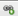
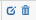

News
====

News feature will help you to provide your customer an updated information on services or some business aspects of your company. 

**To create News** go to *Support → News* and click on *Add News* on the top right of the table.

"*Create news*" window will show up, where you will be able to fill in Title and Description field, choose the correct date, select Partners and location if necessary, and write a text of the news.

The editing option of the text allows you to edit or format the text, insert URL links and images. 

For example, you can insert URL link to redirect customers to your company's website to get more information about particular topic. To do so you simply need to highlight the word or phrase, which will be linked to a webpage, click on  icon in the edition field under the text and enter URL. Then submit and save it.

After news are created it will be possible **to edit or delete them** with  icons in Actions section. 

It is also possible **to sort the news** by the Partner or Location.

With the help of icon  at the bottom left of the table you can print or copy the list of the news or save it in PDF or SCV format. By clicking on icon  you will choose columns to be displayed in the news table by drag &dropping them.

Customers will be able to see the news on Customers Portal on their *Dashboard*. By clicking on the *Title* of the news they will read them and by clicking on interactive link they will be transferred to a webpage if needed.

It is important to enable option *Show portal news* in *Config → Portal → Dashboard* in Splynx, so customers will be able to see the news. 

