Tickets
=======

####Administrators

Once you've connected to Splynx as an administrator:

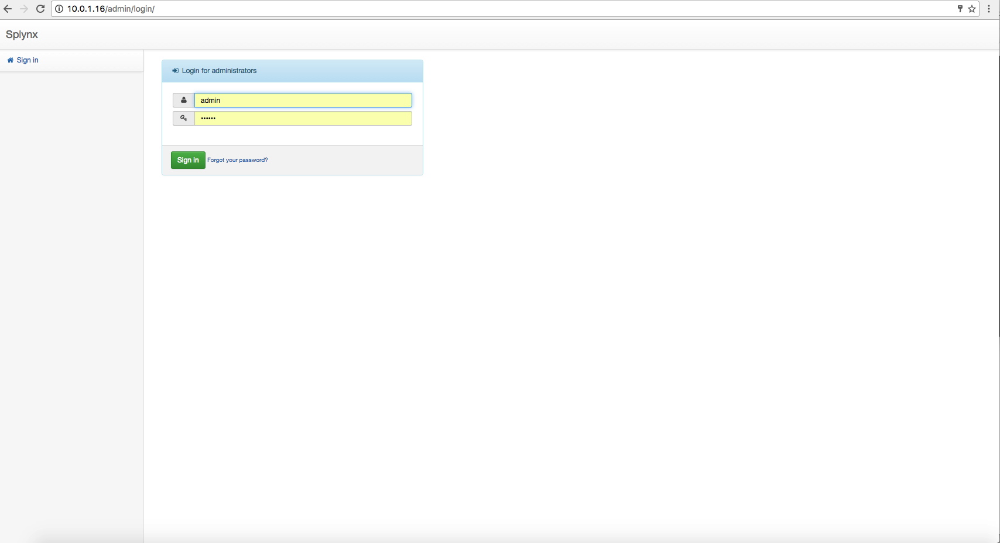

**To create a ticket** click on *Support → Tickets → New & opened* and then click on *Create ticket* at the top-right corner of the screen.

In a new window will be possible to create a ticket by filling in following fields:

* **Customer** - which customer is ticket open for

* **Assign to** - who you want to assign the ticket to

* **Subject** - write the subject of the ticket

* **Priority** - it can be Minor, Major, Critical

* **Status** - it can be New, In process, Closed

* **Message** - write the message body

* **Template** - option for selecting and loading tickets templates.

* **File** - possibility to attach a file

* **Location** - choose location if necessary.

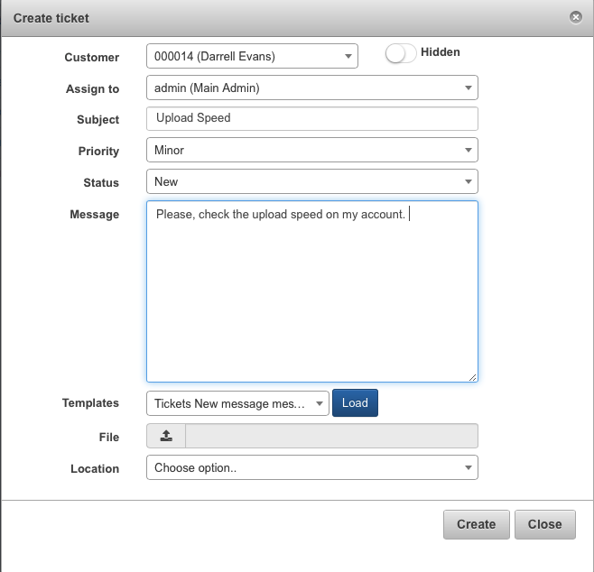

Option *Hidden* <icon class="image-icon"></icon> allows you to hide ticket from a customer.

It is possible to create a [new field](customer_management/custom_additional_fields/custom_additional_fields.md) in the ticket. Information about **adding custom fields** is available here - [Additional fields](configuration/system/additional_fields/additional_fields.md). Remember, that in order to see the new field in the main table, you should enable it by clicking on icon <icon class="image-icon"></icon> below the table.

The created ticket will be visible in the *New and opened tickets* table. It is even possible **to filter the ticket** by *Period, Customer* and *Assigned to*.

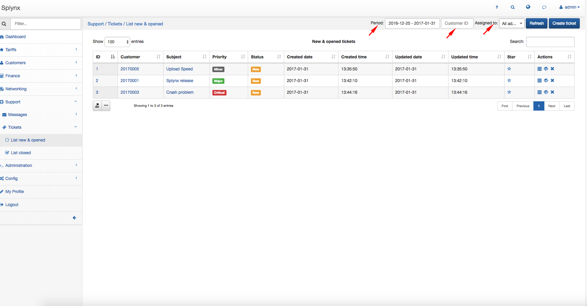

After the creation, it is possible to edit the ticket, mark as unread or close the ticket with the actions <icon class="image-icon">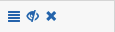</icon>

You can also add a message and change the status on "*in process*".

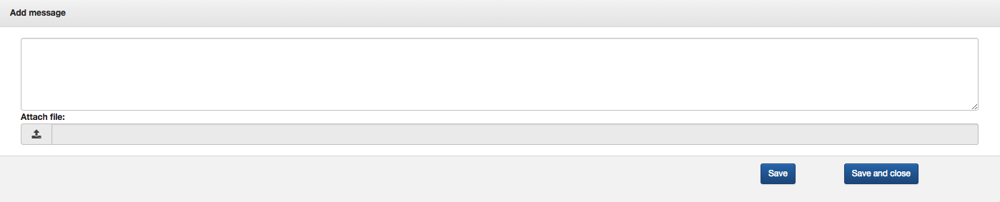

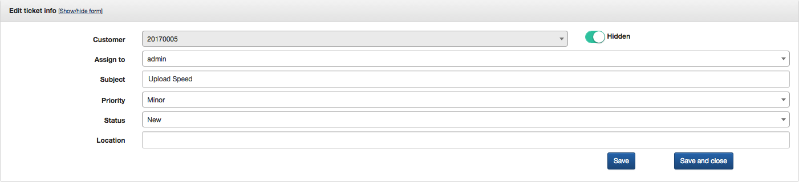

Once the ticket has been resolved, you can change the status on "*closed*" and close the ticket. Every closed ticket is shown in *Support → Tickets → List of closed*.

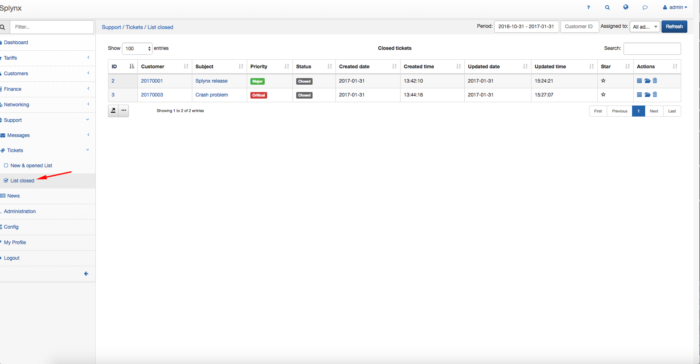

####Customers

Once you've connected to Splynx as a customer on Customer Portal:

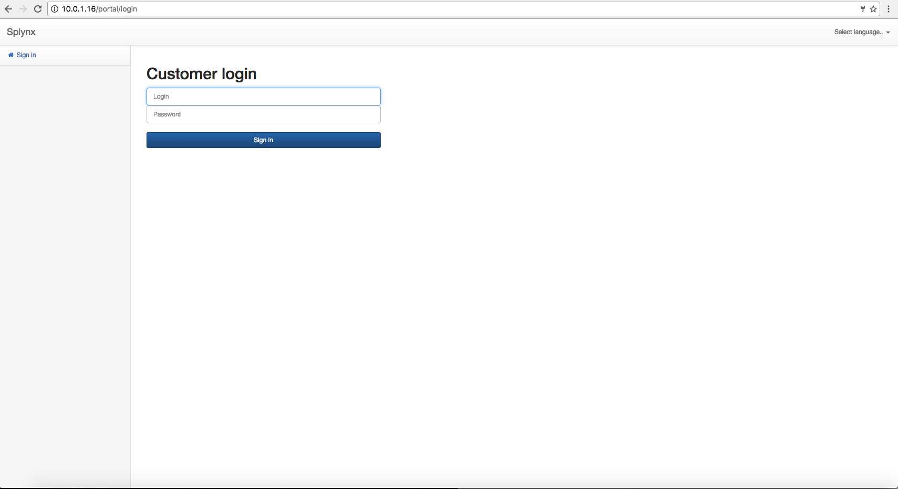

In the tickets' table every ticket associated to the customer is shown. **To create a ticket** click on *Support → Tickets* and click on *Create ticket*.

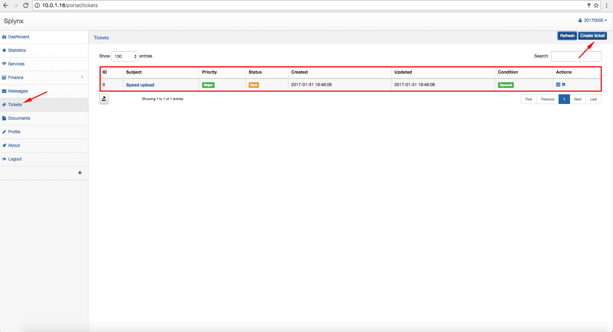

A window will pop up and it will be possible to create a ticket by filling in following fields:

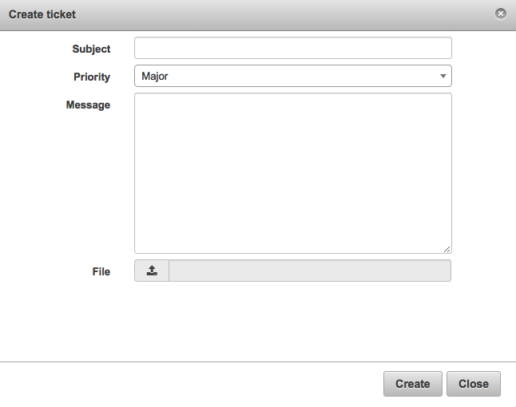

* **Subject** - the subject of the ticket

* **Priority** - it can be: *Minor, Major, Critical*

* **Message** - the message

* **File** - possibility to attach a file

After the ticket is created, it is possible to view the ticket or close it with the actions <icon class="image-icon"></icon>.

When the ticket is viewed, it is possible to add a message.

Once the ticket has been resolved, it is possible to change the status on "*closed*"  or reopen it again with the action <icon class="image-icon"></icon>.

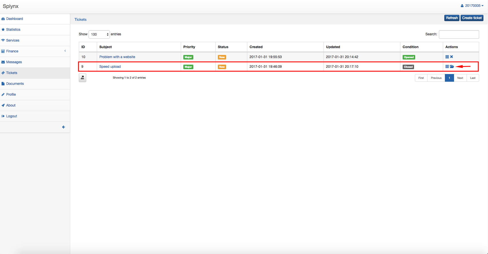

Information about **tickets configuration** can be found here - [Support](configuration/main_configuration/support/support.md).
