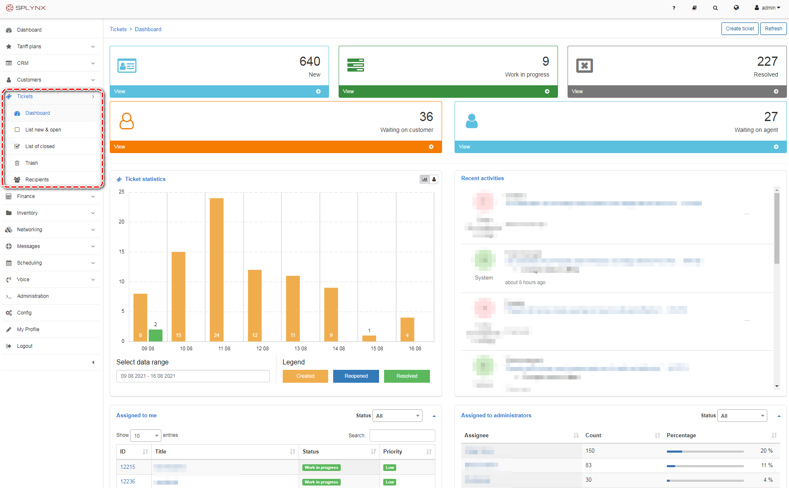

Tickets
=============

The **Tickets** system is the most important part of Splynx. It allows to assign quickly inquiries to the most relevant agent, provide all the context you need to resolve issues, track inquiries from customers and automate routine support tasks. Using the helpdesk ticketing system in Splynx bring your support costs down and make your efforts more successful.

The **Tickets** module is separated into the next sections:

Follow the links below for more information:

* [Tickets Overview](tickets/tickets_overview/tickets_overview.md)

* [Tickets Recipients](tickets/tickets_recipients/tickets_recipients.md)
