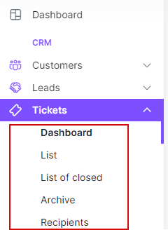

Tickets
=============

The *tickets* system is the most important part of the Splynx. It allows to quickly assign inquiries to the most relevant agent, provide all the context you need to resolve issues, track inquiries from customers and automate routine support tasks. Using *tickets* solution bring your support costs down and make your efforts more successful.

The *tickets* module is separated into the following sections, please follow the links below for more information:

* [Tickets Overview](tickets/tickets_overview/tickets_overview.md)

* [Tickets Recipients](tickets/tickets_recipients/tickets_recipients.md)
