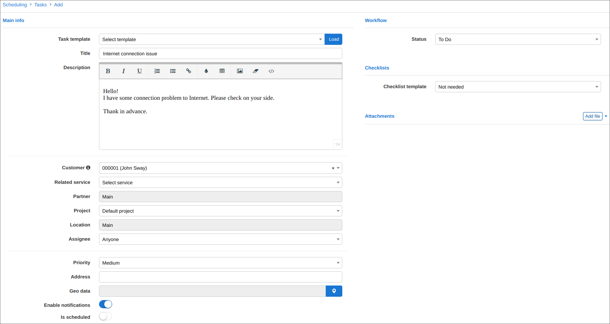

Tickets
=======

The Splynx ticketing system has been designed to empower technicians and satisfy customers by means of integration and automation. We welcome you to your in-house support platform.

To help understand both perspectives, let's separate our ticketing system into two sections or views, being an administrative perspective and a customer experience.

**ADMINISTRATORS**

**Dashboard**

The ticketing dashboard shows the following sections:
* Status of all current/open tickets on the system.
* General and per-agent statistics of all your support agents
* Live log of recent activities of tickets.
* Quick reference to the tickets table of the administrator currently logged into the system

Administrators are able to create the tickets in 3 ways:
1. From `Tickets > Dashboard` and clicking **Create** in the top right corner of the page.

2. Directly from a customer's profile by clicking on the **Support** button and selecting **Create** from the drop-down menu.

3. Within the list of new & open tickets `Ticket > List new & open`, there is a button located at the top right of the page.

After clicking on the "create ticket" button anywhere in the system, you will be redirected to the *'Create ticket'* window where the following fields have to be completed together with a body for the ticket:

* **Customer** - which customer to open the ticket for
* **Assign to** - the administrator the ticket will be assigned to
* **Subject** -  a relevant subject of the ticket, usually pertaining to the reason for opening the tickt
* **Priority** - the urgency of the ticket which can be set to low, medium, high or urgent
* **Status** - the state of the ticket currently which can be set to New, Work in Progress, Waiting for Customer, Waiting on agent, Resolved
* **Group** - the ticket can be filtered to a specific group of admins depending on the nature of the ticket
* **Type** - the reason for creating the ticket which can be set to Question, Problem, Incident, Feature request, Lead
* **Message** - the body of the ticket can be typed here
* **Attachments** - used to attach files to the ticket

It is possible to add a canned response to the message body to optimize the productivity of admins.

In Splynx we have added the ability to configure canned responses to minimize on typing and save on time to ultimately create efficiency. To populate the body of the ticket with a canned response, simply click on the arrow highlighted below and choose a response from you list of canned responses:

New canned responses can be added by clicking **Add response** button

or in `Config > Ticket canned responses`.

The  *Hidden* <icon class="image-icon"></icon> toggle allows you to hide tickets from a customer.

You are also able to create [new fields](customer_management/custom_additional_fields/custom_additional_fields.md) in the tickets module. More information about **adding custom fields** is available here - [Additional fields](configuration/system/additional_fields/additional_fields.md). Remember, that in order to see the new field in the main table, you should enable it by clicking on the breadcrumbs <icon class="image-icon"></icon> icon below the table.

Once the ticket has been created, it will be visible in the `New and opened tickets` table. Here you can **filter tickets** by *Condition, Period, Customer/Lead ID, Group, Partner, Type or Type*. We've added the capability to search for specific text with the _Text search function_ or the customers full name in the _Find Filter_ field. You can also choose the list of new and opened ticket to view filtered by the administrator assigned or the status of the tickets.

Depending on the layout you have chosen to view ne and opened tickets with the layout <icon class="image-icon"></icon> icons, you are to reassign, change the status of, change the priority or the type of the ticket, directly from the tickets table.

The ticket working area is divided into 3 parts: *ticket properties, action buttons and messages area*.

* In the properties we can reassign the ticket to the specific administrators, change status, prioritize the work, assign to a specific group and set the ticket type.  We also oversee the Customer's information like Name, Email, Phone number and recent tickets.

## Ticket properties section parameters:

* **Customer/Lead** -  changes the customer this ticket has been open for
* **Assigned to** - reassign the ticket to specific administrator
* **Subject** -  change the subject of the ticket
* **Priority** - change the urgency of the of the ticket
* **Status** - change the current state of the ticket
* **Group** - change the group of administrators this ticket is available to
* **Type** - change the reason for the tickets
* _Show more options_ - this option will either hide or display additional fields of tickets

* The action buttons allow us to add a note, reply or forward the answer, check all ticket activities and schedule the task for an engineer directly within the ticket.

## Tickets actions section parameters:

* **Reply** - used to respond to a message or add a message to the conversation, this button opens up the body area of the message for you to type or insert content from canned responses.
* **Add note** - this button opens a typing area to add a note to the ticket that is not visible to the customers
* **Forward** - this button opens the "Cc" and "Bcc" fields for forwarding the response as well as ticket content to another email address(s)
* **Actions** - this is a drop-down list of functions namely:
_Show Activities_ - to view all activities executed to/within the ticket
_Show all files_ - provides a list of all attachments within the ticket
_Create task_ -  integration to the scheduling module, this button allows you to create a task pertaining to requests made within the ticket
_Merge ticket_ - allows merging of the current ticket with another
_Close ticket_ - marks ticket status as resolved and the ticket is moved into the list of closed tickets

Below is a quick look at the task creation page after clicking the create task option

Once a ticket has been resolved, you can change the status on *closed* and close the ticket or press the **Update and Close** option of the update button immediately after adding a response to the ticket. All closed tickets are shown in `Tickets → List of closed`.

------

**CUSTOMERS**

Your customers can also create tickets in three ways:

1. By sending a query  to your incoming email (*support@yourdomain.com*), and the ticket will be created automatically on the system. Incoming mail configuration can be found [here](configuration/main_configuration/incoming_mail.md).

2. By creating a ticket from Customers Portal in `Tickets > Create`

* **Subject** -  a relevant subject of the ticket, usually pertaining to the reason for opening the tickt
* **Priority** - the urgency of the ticket which can be set to low, medium, high or urgent
* **Message** - the body of the ticket can be typed here
* **Attachments** - used to attach files to the ticket

Once the ticket is created it is possible to view or close it by using the following icons <icon class="image-icon"></icon>:

3. By creating a ticket from Splynx mobile self-service app.

More information about **tickets configuration** can be found here - [Support](configuration/main_configuration/support/support.md).
