Tickets Overview
=======

The ticketing system in Splynx was designed to empower technicians and meet customers needs through integration and automation. It provides all the functionalities you would expect from a support platform for your support team and customers. Through the following tutorial, we will learn how to use **Tickets** and get to know its features.

To help understand both perspectives, let's separate our ticketing system into two sections or views: one is the administrative perspective and the other is the customer experience.

**ADMINISTRATORS**

**Dashboard**

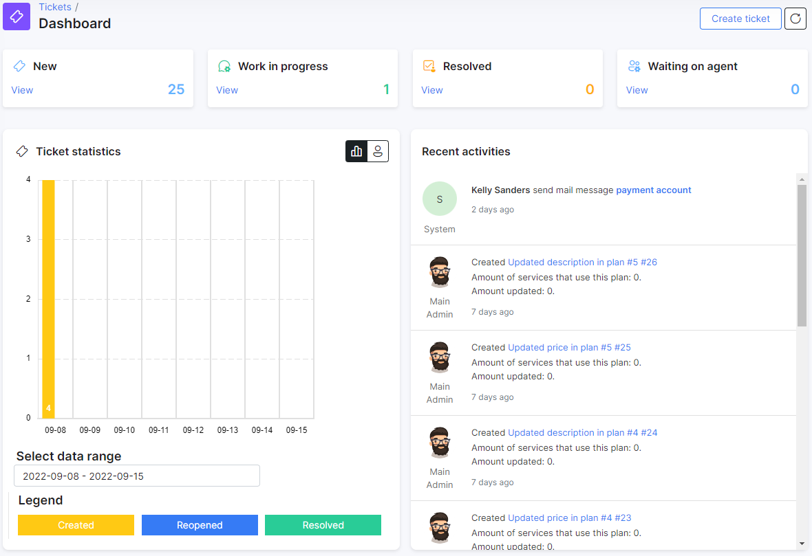

The ticketing dashboard shows the following sections:

* Number of all tickets in the system with the statuses *New*/*Work in progress*/*Resolved* and *Waiting on agent*;
* General and per-agent (top 10) statistics of tickets with date range selection;
* Live log of the recent activities in tickets;
* Quick reference to the tickets that were assigned to the administrator currently logged into the system;
* Statistics of assigned tickets between administrators in the system.

Administrators can create the tickets in 3 ways:

1. In `Tickets → Dashboard`, click on the **Create ticket** button at the top-right corner of the page.

2. Directly from a customer's / lead's profile by clicking on the **Tickets** button and selecting the option **Create** from the drop-down menu.

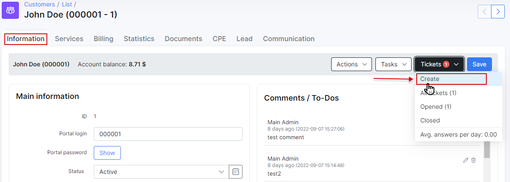

3. Within the list of **new & open** tickets `Ticket → List new & open`, there is the **Create ticket** button located at the top right of the page.

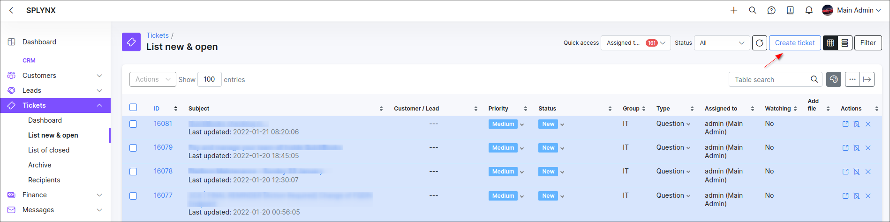

After pressing the button in any of the above ways, you will be redirected to a new window, where you need to fill out the following fields along with the message area:

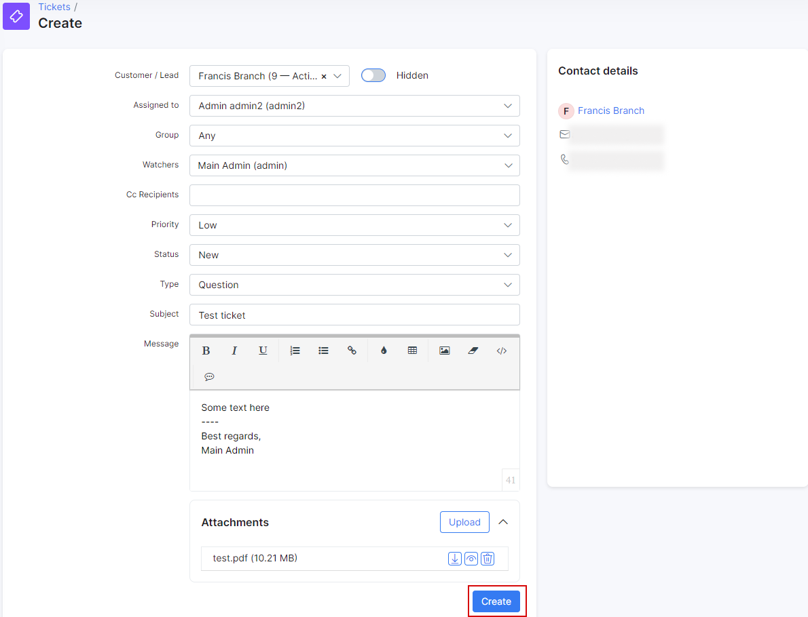

* **Customer** / **Lead** - for which client/lead to create a ticket;
* **Assign to** - the administrator to whom the ticket will be assigned;
* **Group** - the ticket can be filtered to a specific group of tickets depending on the context of issue. The new group (-s) can be created in `Config → Helpdesk → Miscellaneous ticket configuration` (*Ticket groups* section);
* **Watchers** - administrator in Splynx who tracks the progress of a specific ticket but is not responsible for it. The added watcher will be informed of any changes in ticket activity through notification. The notification and its template can be configured in `Config → Helpdesk → Ticket notifications`;
* **Cc Recipients** - CC recipients receive an exact copy of the ticket and any further `Reply All` responses in the thread. For example, you are sending a ticket to a lead with the network project and you want to send a copy of your email to your managers, so that they are kept in the loop. Pay attention, all recipients of the email will also see who has been CC’d;
* **Priority** - the urgency of the ticket which can be set to `low`, `medium`, `high` or `urgent`;
* **Status** - the current state of the ticket, which can be set to `New`, `Work in Progress`, `Resolved`, `Waiting on customer` or `Waiting on agent`. The ticket statuses can be configured in `Config → Helpdesk → Miscellaneous ticket configuration`;
* **Type** - the reason for creating the ticket which can be set to `Question`, `Incident`, `Problem`, `Feature request` or `Lead`. The ticket types can be configured in `Config → Helpdesk → Miscellaneous ticket configuration`;
* **Subject** -  a relevant subject of the ticket, usually referring to the reason for opening the ticket;
* **Message** - the main text content of the ticket can be typed here;
* **Attachments** - used to attach files to the ticket.

The `Hidden` allows you to hide the ticket from the customer.

------------

To minimize the typing process and save time of your team in general, use the **Canned responses** when creating tickets in Splynx. A new canned response can be added by clicking the **Add response** button.

**NOTE:** By default, a response added in this way will be associated with the `Personal` group.

After a response is added, simply click on <icon class="image-icon"></icon> icon and choose your response to insert it into the ticket:

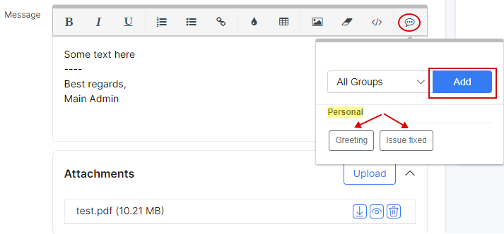

For more information, see [Canned response](configuration/support/ticket_canned_responses/ticket_canned_responses.md) guide.

------------

In the *Tickets* module you can create new additional fields according to your needs.

For more information, see [Additional fields](configuration/system/additional_fields/additional_fields.md) tutorial.

To show / hide the build-in columns or change its order in the ticket list, click on <icon class="image-icon">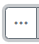</icon> icon at the top-right corner of the table

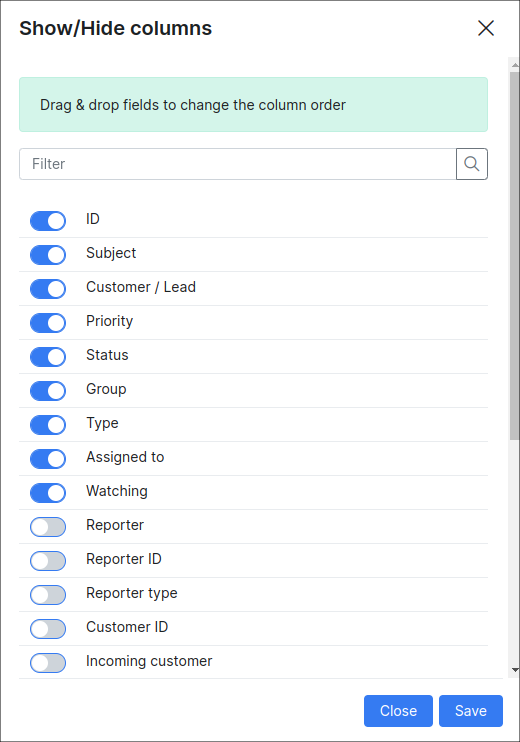

------------

Once the ticket has been created, it will be visible in the `List new & open` table. Click on **Filter** button to sort tickets by *Condition*, *Period*, *Customer/Lead*, *Group*, *Partner*, *Type*, *Priority*. Also, it's possible to search for specific text with the help of **Text search** field in the filter sidebar. On the top bar, click on the **Quick access** menu to filter tickets by assigned administrator or click on **Status** to show tickets only in a certain status.

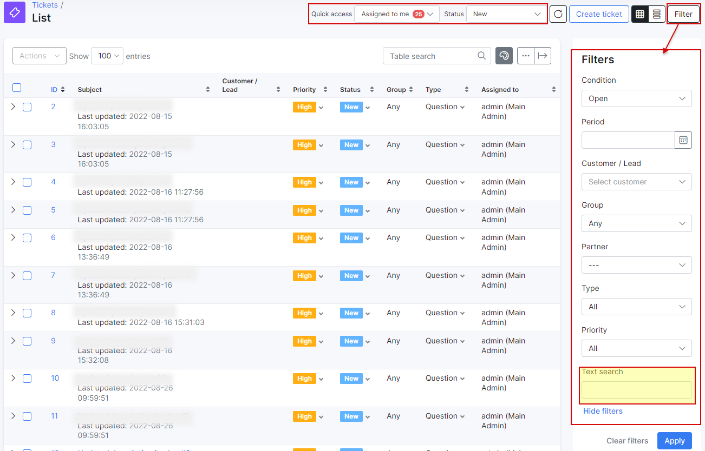

The list of tickets can be shown in two **layouts**: **table view** and **card view**. Use <icon class="image-icon">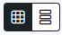</icon> icon to change to your preferred layout.

Use the mass **Actions** menu for selected ticket (-s) to reassign, change the status / priority, type of the ticket etc. directly from the tickets table. The available options in the drop-down list depend on the section that is currently opened.

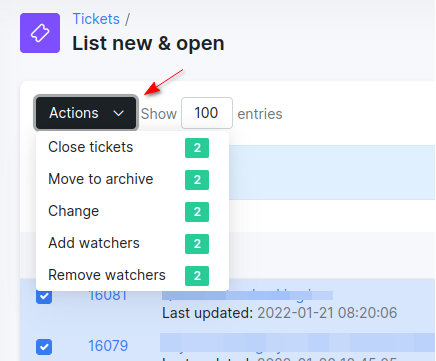

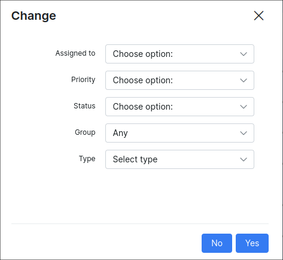

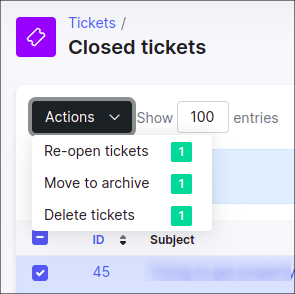

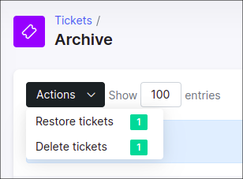

In addition, we can manage each ticket in the table with the available actions in the column with the same name:

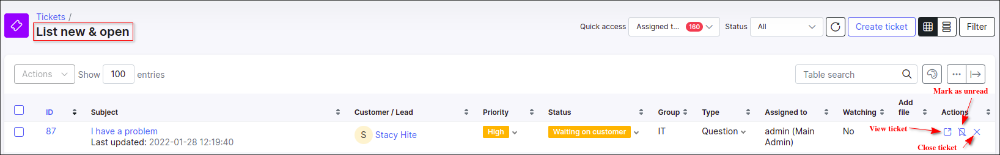

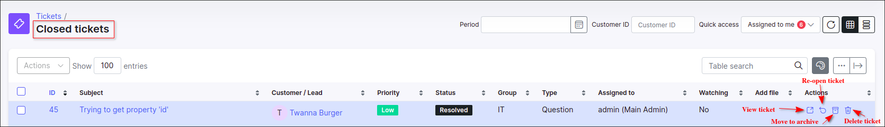

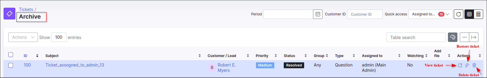

------------

The **ticket working area is divided into 3 parts**:

1. **ticket properties**;
2. **action buttons**;
3. **message area**.

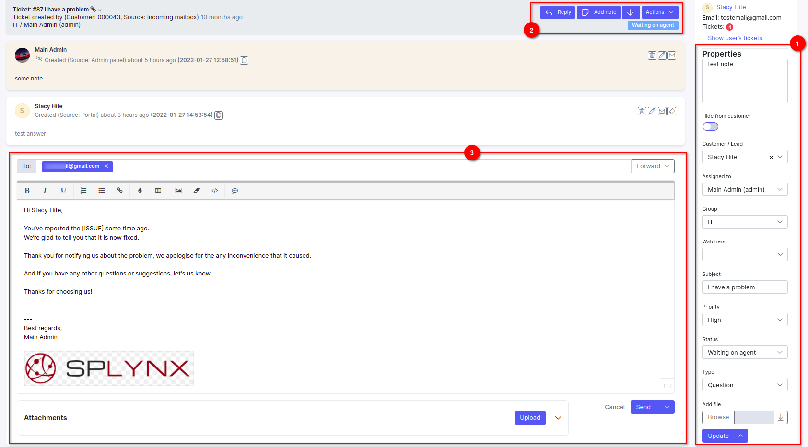

**Ticket properties section parameters:**

* **Note** - area for entering a note that is not visible to the customer. This note is only visible in the sidebar;
* **Hide from customer** - toggle to hide/show the ticket from the customer;
* **Customer/Lead** - change the customer/list for whom the ticket was opened;
* **Assigned to** - reassign the ticket to a specific administrator;
* **Group** - change the group of ticket with which administrators are associated;
* **Watchers** - add watchers to view all ticket activity;
* **Subject** - change the subject of the ticket;
* **Priority** - change the urgency of the ticket;
* **Status** - change the current state of the ticket;
* **Type** - change the reason for the ticket;
* **Add file** - attach file to the ticket.

The **Update** button is used to save changes made in the sidebar of the ticket properties. Note that the button has an additional function that allows you to save changes and change the status of the ticket at the same time.

**Ticket action buttons:**

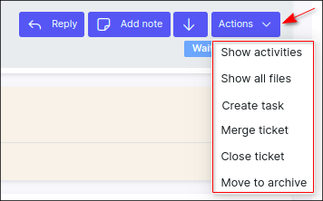

* **Reply** - used to respond to a message or add a message to a conversation, this button opens the message area for entering or inserting content from canned responses;
* **Add note** - add a note to the ticket thread conversation, such note won't be visible for a customer, only to ticket's watchers or other administrators with a permission to view a ticket;
* **Jump to last message** - scroll down to the last message in the ticket thread conversation;
**Actions** drop-down menu:
  * **Show activities** - show all activities related to the current ticket, including automatic change of ticket status by the system;
  * **Show all files** - show all attached files in the ticket;
  * **Create task** - create a new task for support team, all pre-written messages, including notes, will be quoted in the description of the new task;
  * **Merge ticket** - merge one ticket into another ticket, e.g. you received two support requests about the same issue from the same customer;
  * **Close ticket** - close the ticket, in new pop-up window the option `Close without notification` can be enabled;
  * **Move to archive** - change the status of the ticket to resolved and move it to the Archive.  

To **share a ticket** thread conversation with an agent who doesn't have a Splynx account, e.g. from another department in you company, you can enable **Public URl** for the ticket. Open the necessary ticket, next to its title click on a small arrow sign, a small pop-up window should appear, click on the **Public URl** toggle to enable the option, the direct link to the current ticket will be copied to the clipboard.

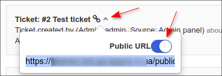

In addition, for each text block (message) of the ticket there are additional actions:

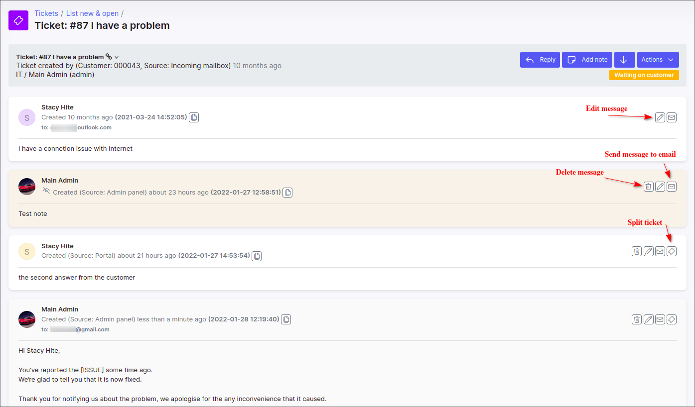

* **Edit message** - each message in the thread of ticket can be edited by the administrator;
* **Send message to email** - send a separate message from the ticket thread to the email, a message text will be quoted;
* **Delete message** - remove separate message from the ticket;
* **Split ticket** - opens the form to create a new ticket with the quoted response of the client in the message area.

**Ticket message area**

* **Forward** - this button opens the `Cc` and `Bcc` fields for forwarding the response as well as ticket content to another email address(s);
* **Send** - send a response to the customer, an additional feature allows you to respond and change the status of the ticket at the same time;
* **Upload** - used to attach file (-s) to the ticket.

------------

Once the issue reported in the ticket is resolved, click on the small arrow next to the **Update** button to open more options, click on **Update and close** item to close the current ticket, its status will be set to `Resolved` and the ticket will be moved to `Tickets → List of closed` section.

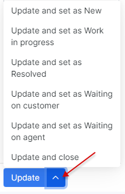

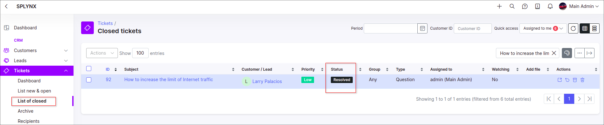

------

**CUSTOMERS**

Your **customers can also create tickets in three ways**:

1. By sending a query to your **incoming email** (*support@yourdomain.com*), and the ticket will be created automatically in the system. Suggested read: [how to configure your Inboxes](configuration/main_configuration/incoming_mail.md).

2. By creating a ticket on Customers [Portal](customer_portal/customer_portal.md) in `Tickets → Create ticket`

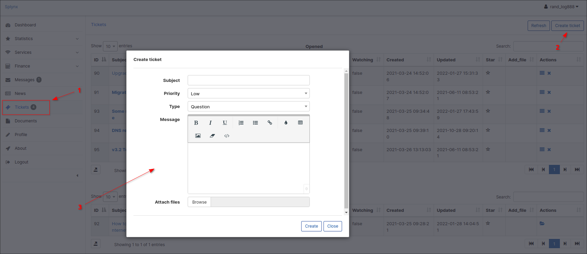

* **Subject** -  a relevant subject of the ticket, usually pertaining to the reason for opening the ticket;
* **Priority** - the urgency of the ticket which can be set to low, medium, high or urgent;
* **Type** - the reason for creating the ticket which can be set to `Question`, `Incident`, `Problem`, `Feature request` or `Lead`.;
* **Message** - the main text body of the ticket;
* **Attachments** - used to attach files to the ticket.

Once the ticket is created it is possible to **view** or **close** it by using the following icons <icon class="image-icon"→</icon within the table/list of opened tickets:

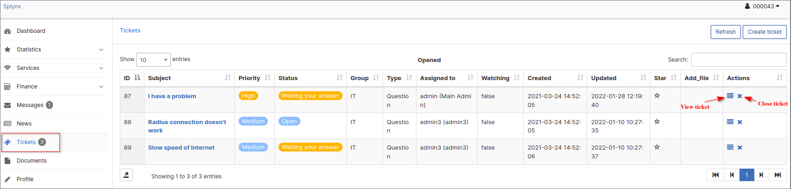

3. By creating a ticket from mobile app - SPLYNX - [Customer Application](apps/customer_app/customer_app.md).

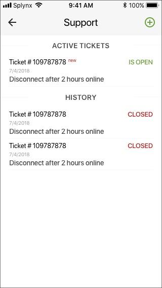

------

Once a ticket is created by a customer or administrator, notifications are sent to each other via email.
Depending on the template you use for tickets, tickets can include a ticket main message, which can ultimately create a convenience because customers/administrators can respond to the ticket directly from the email.
If the template does not include a ticket main message, customers/administrators can log in to their respective portals using the link included in the ticket notifications.

For more information, see

- [Templates](configuration/system/templates/templates.md) (select the *Tickets* type from select menu);
- [Ticket notifications](configuration/support/ticket_notifications/ticket_notifications.md)

More information how to automate your work with tickets and configure its additional settings, you can find in the the next tutorials:

- [Ticket automation](configuration/support/ticket_automation/ticket_automation.md);
- [Helpdesk](configuration/support/support.md).

## List of new & opened

In this section you will find a list/table of **all new and opened tickets** in Splynx. For administrators who are part of the support team and respond to customer requests, this is their workspace in the ticketing module.

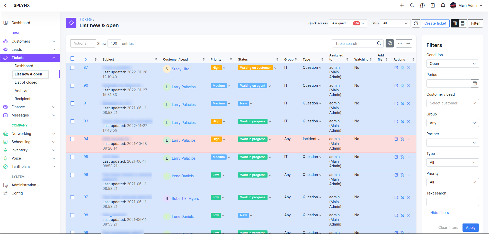

In the filter above the table you can choose to show tickets assigned to a specific administrator, unassigned tickets, or all new tickets in the system. You can also filter tickets by status after selecting a ticket source to display. For ease of access, the **Refresh** and **Create ticket** buttons have been added along a button to hide or show the filter sidebar.

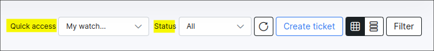

Press the **Filter** to open its main sidebar. This filter can be used to specify tickets to view based on the selections in the specified fields

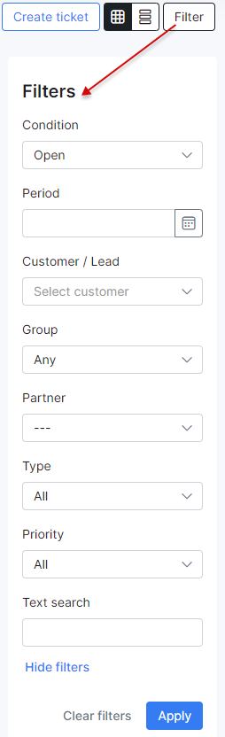

Description of the **filter sidebar parameters**:

- **Condition** - search in the list of open, closed or all tickets;
- **Period** - search for tickets within a specific time period;
- **Customer / Lead** - search for tickets via the Splynx customer/lead *Full name*, *ID* or *Portal login*;
- **Group** - search for tickets by a specific group of tickets with which administrators are associated;
- **Partner** - search for tickets by a particular partner the customer is related to;
- **Type** - search for tickets by its specific type (reason for opening);
- **Priority** - search for tickets marked with a specific urgency;
- **Text search** - search for tickets containing the specified text.

After selecting the necessary values in the provided fields on the sidebar of the filter, click the **Apply** button to search for the tickets or click on the **Clear filters** button to clear all selected values and all the tickets in the table will be displayed.

The red dot on the **Filter** button means that the filter is applied:

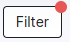

The layout of each table related to the *Tickets* section in Splynx can be changed using two buttons - **Table view** and **Card view**. Deciding which kind to use is a matter of personal preference.

**NOTE:**

- Only when using the table view layout, the **Show/hide columns** <icon class="image-icon"></icon> and **Export to** <icon class="image-icon">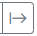</icon> options are available.

| <icon class="image-icon">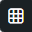</icon> (Table view) | <icon class="image-icon">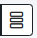</icon> (Card view)  |
| ------------ | ------------ |
|  | 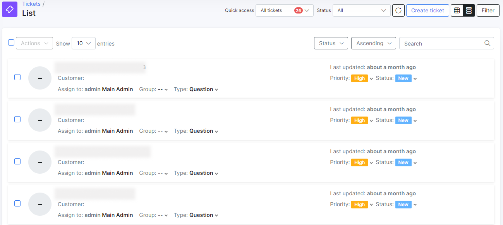 |

## List of closed

In this section you will find a list/table of **all closed tickets** in Splynx.

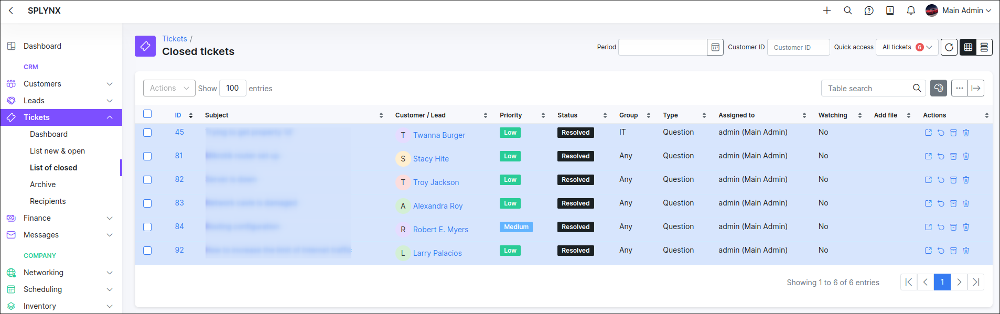

At the top of the table is a filter that can be used to view closed tickets. The results can be filtered by the time **period**, the **customer id** and the **assignee**:

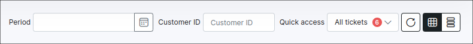

To **re-open ticket** or apply any other actions use the **Actions** mass selection menu or click the appropriate icon in the table column of the same name.

## Archive

In this section you will find a list/table of **all archived tickets** in Splynx.

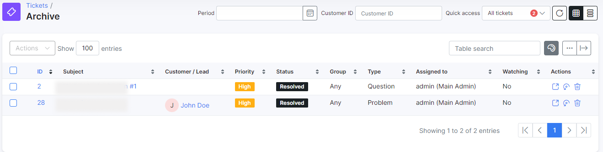

The archived ticket list also be filtered to view the contents of a specific time period, by the client ID, by assignee to a specific administrator, by unassigned or by all tickets in the system.

To **restore ticket** or apply any other actions use the **Actions** mass selection menu or click the appropriate icon in the table column of the same name.

------

You might also like: [Recipients](tickets/tickets_recipients/tickets_recipients.md)
