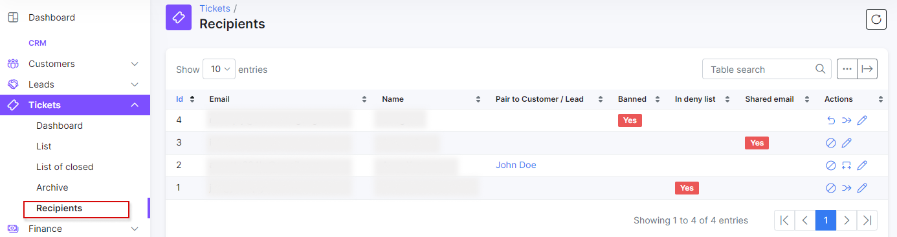
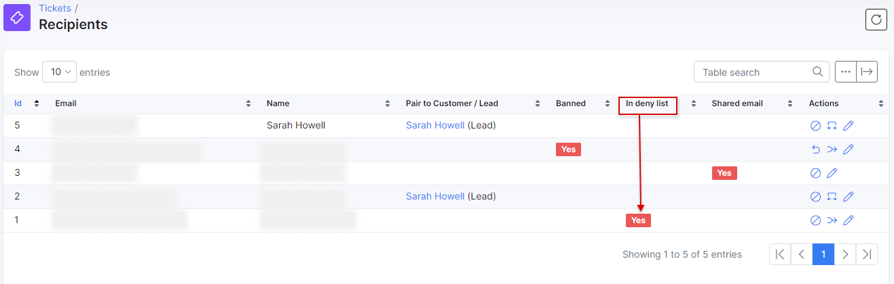
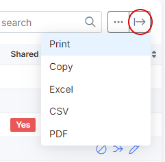

Tickets Recipients
=============

In this window we can pair an unknown email addresses to the existing customers/leads in Splynx. As a result, this will help to assign all received tickets from unrecognized email addresses to specific customers/leads and they will receive correct tickets' notifications to such new email addresses.
Also, it's possible to unpair email address with customer/lead, edit sender name, disable pairing, ban the sender's email address and check if the email is in deny list.

**NOTE!:** To make pairing feature work correctly, it's required to set up [SMTP](configuration/main_configuration/email_config/email_config.md), [Inboxes](configuration/support/inboxes/inboxes.md) and enable [Ticket notifications](configuration/support/ticket_notifications/ticket_notifications.md).

The following actions can be applied in the *Recipients* table:

* **Ban requester** <icon class="image-icon"></icon> - sender email address will be banned to send message to [Incoming mailbox](configuration/support/inboxes/inboxes.md), the next new ticket from this email address won't be created in Splynx;

* **Unban** <icon class="image-icon"></icon> - sender email address will be unbanned and the next new ticket will be created in Splynx;

* **Pairing** <icon class="image-icon"></icon> - to map an unknown email address to existing customer/lead in Splynx, ticket that was created will be assign to paired customer/lead;
  * **Assign all tickets** - toggle allows to assign, all unassigned tickets created from an unknown email to the existing customer/lead;

**Tip:** If unrecognized email address is paired to some customer/lead e.g. by mistake in *Recipients* table, we can reassign the current ticket and the future ones to other customer/lead directly from ticket, after adding new customer/lead and pressing *Update*, the new *Change pair for recipient* window will appear, press *Yes* to proceed. If the `Shared email` option is enabled, the mass reassignment function will not work (only the current ticket will be assigned to specific customer/lead).

* **Edit sender** <icon class="image-icon"></icon> - to edit sender's name in [Tickets](tickets/tickets_overview/tickets_overview.md);

  * **Shared email** - toggle allows to mark an unknown email address as shared one, in this case pairing will be disabled for such email, for example support team receives a lot of messages from one request form (the same email address) and we need to block `Pair Customer/Lead to requester` option in ticket *Actions* list, but at the same time tickets should continue to be received. However, each ticket can be assign to specific customer separately;

* the status <icon class="image-icon"></icon> in the column `in deny list` - means that the email address was added to **Deny list** in `Config → Tickets →` [Inboxes](configuration/support/inboxes/inboxes.md). Ticket from these email will not be created in Splynx.

**Example #1: Notifications to customer's emails:**

Let's imagine that we have set up **SMTP**, **Incoming mailbox** (`support@support.com`) and enabled **Ticket notifications**. In SMTP config, we use `admin@support.com` address in both *Sender's email* and *Admin email* fields.
Customer sent a message to `support@support.com` from his new mail address, as a result, the new ticket will be created in Splynx. After that we paired new mail address with our customer in `Tickets → Recipients`.
To `admin@support.com` will be sent a notification *New ticket created*, when administrator directly replies on this notification message, the new notifications `New ticket created (Request received) `and `New message in ticket` will be sent to customer's paired mail address but to customer's mailbox (`Email` field in customer profile) - will be sent only `New message in ticket`. To customer's `Billing email `no notifications will be sent at all.

**Example #2: The relationship of the customer's message to the ticket:**

We paired two mail addresses to one customer in `Tickets → Recipients`: *address1@xxx.com* and *address2@xxx.com*. The customer wrote a message from *address1@xxx.com* to our **Incoming mailbox** (`support@support.com`), after that the new ticket was created in Splynx. If customer replies (the `subject` of the message shouldn't be changed, otherwise will be created a new ticket) from *address2@xxx.com* to ticket notification (e.g. `New message in ticket`), the message will be added to the existing ticket's thread (created from *address1@xxx.com*) in Splynx .

The *Recipients* table can be modified to display the necessary fields with <icon class="image-icon"></icon> icon at the bottom of the table or the date can exported in a format of choice with the export <icon class="image-icon"></icon> icon.

