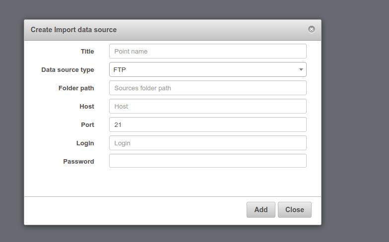
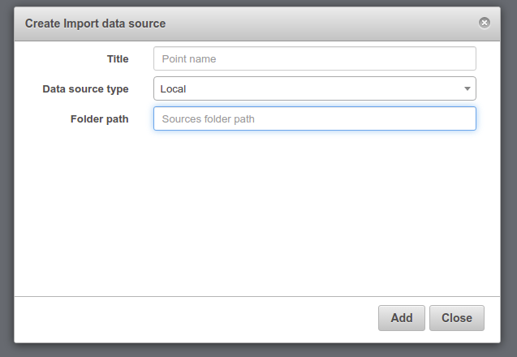
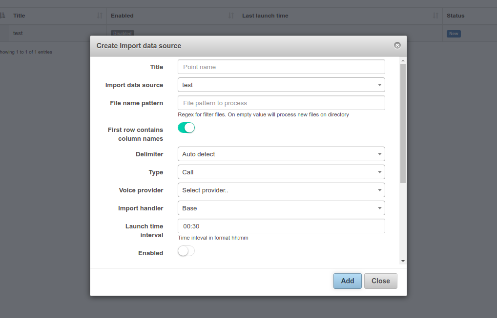
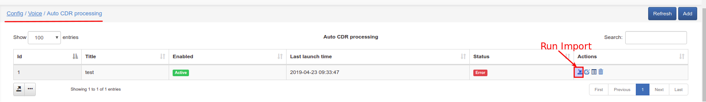
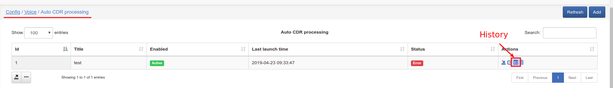
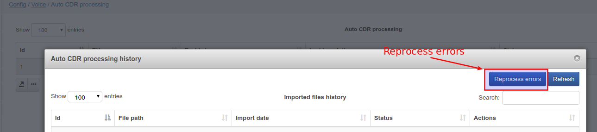

Auto processing
==========

Now (from splynx 2.3) the Voice auto CDR processing is managed here. We can import a CDR's for charge the customer and print in his invoice the register of calls.

It's like Voice / Processing / CDR import, but here we can import many CDR's together.

To import CDR's you need to go to the source and configure "Import data source"

Here you need to set:

  * Title - any name.

  * Data source type - select type from drop menu.

    * SFTP - if you select "SFTP" than you will need to enter RSA private key

    * FTP - if you select "FTP" than you will need to set all that what in "SFTP" but without RSA key

    * Local - if you select "Local" than you will need to set only Title and Folder path

  * Folder path - set your path to folder

  * Host - set yor host IP address

Now you need to go to the Config / Voice / Auto CDR processing and create Import data source

Here you can set:

  * Title - any name.

  * Import data source - select data source from drop menu

  * File name pattern - Regex for filtering file names (uses pcre syntax):
    Will process all files that have pattern entrances in filename.

#### Examples:

    AB-CDR-20190201013000-1-0025B516891F-125464.csv

    BC-CDR-20190201013000-2-0025B516891C-125465.csv

    BC-CDR-20180201013000-3-0025B5168912-12546.csv

|Pattern         | Description                                                     |
|----------------|-----------------------------------------------------------------|
|AB              | Will filter file names that have 'AB' symbols                   |
|CDR             | Will match all 3 files                                          |
|2019            | Will match first two files which contain '2019' in their names  |
|516891[A-Z]     | Will match first two files with matches 516891F, 516891C        |
|516891[F2]      |Will match first and third files with matches 516891F, 5168912   |
|516891[F2]-\d{6}|  Will match only first one                                      |

**Some of special characters:**

Quantifiers:* + ? and {}

|Quantifier              | Description                                                                    |
|------------------------|--------------------------------------------------------------------------------|
|abc*                    | Matches a string that has ab followed by zero or more c                        |
|abc+                    | Matches a string that has ab followed by one or more c                         |
|abc?                    | Matches a string that has ab followed by zero or one c                         |
|abc{2}                  | Matches a string that has ab followed by 2 c                                   |
|abc{2,}                 | Matches a string that has ab followed by 2 or more c                           |
|abc{2,5}                | Matches a string that has ab followed by 2 up to 5 c                           |
|a(bc)*                  | Matches a string that has a followed by zero or more copies of the sequence bc |
|a(bc){2,5}              | Matches a string that has a followed by 2 up to 5 copies of the sequence bc    |

 OR operator:| or []

|Operator | Description                                                              |
|---------|--------------------------------------------------------------------------|
|a(b|c)   | Matches a string that has a followed by b or c                           |
|a[bc]    | Same as previous                                                         |

Character classes:

| Class | Description                                                                |
|-------|----------------------------------------------------------------------------|
| \d    | Matches a single character that is a digit                                 |
| \w    | Matches a word character (alphanumeric character plus underscore)          |
| \s    | Matches a whitespace character (includes tabs and line breaks)             |
| .     | Matches any character                                                      |

  * First row contains column names - turn it on if first row in your CDR's contain columns names

  * Delimiter - select delimeter from drop menu

  * Type - select from drop menu type of data what you would import

  * Data unit - (If type = Mixed or Data) select from drop menu

  * Voice provider - select provider from drop menu (if you have it)

  * Import handler - select your handler from drop menu

  * Launch time interval - haw often auto processing will running

  * Enable - if it would be turned of than auto processing will run every Launch time interval

After that Auto CDR processing is aded? you can run it manually, go to the Config / Voice / Auto CDR processing and press "Run import" button.
If something was wrong? you can see it in Auto CDR processing history, for this press "History" button, and you will see errors, here you can also Reprocess errors:

