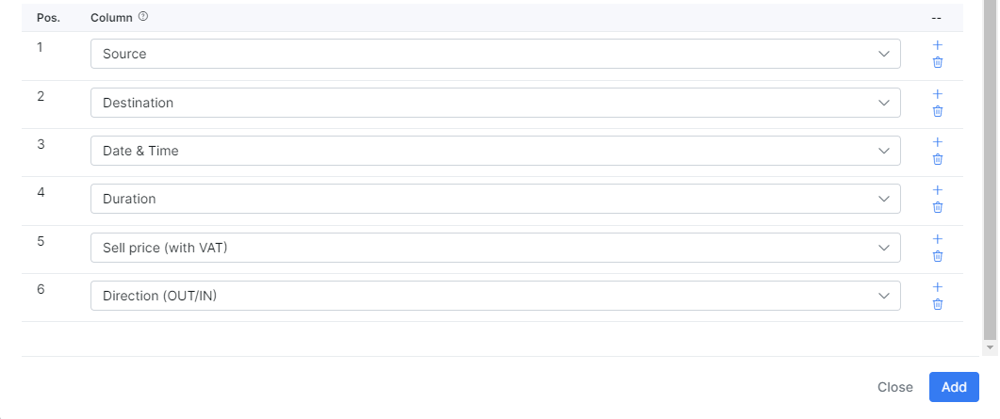

Auto processing
==========

The Voice auto CDR processing is managed here. We can import CDRs to charge customers and print their register of calls on their invoices.

The process is similar to the [Voice → Processing → CDR import](voice/processing/processing.md), but here we can import multiple CDRs together, automatically.

Firstly, for importing CDRs, you need to navigate to *Config → Voice → Import data source* and add a CDR data source location.

Simply click on `Add` button located at the top right of the table:

The following types of data location types can be used:

* **SFTP**
* **FTP**
* **Local**

Adding an SFTP data source:

Adding an FTP data source:

Adding a local data source:

We will use a local storage/data source as an example.

The following parameters need to be configured to add data sources:

  * **Title** - provide a relevant name for the data source location;

  * **Data source type** - select a type from the drop-down menu:

    * SFTP - if you select "SFTP" then you will need to enter a RSA private key. CDR files are located on a FTP server;

    * FTP - if you select "FTP" then you will need to set the same parameters as for "SFTP" but without a RSA key. CDR files are also located on a FTP server;

    * Local - if you select "Local" then you only need to set the Title and Folder path. CDR files are located on the Splynx server;

  * **Folder path** - set your path to the folder with the CDR files;

  * **Host** - set your host IP address;

  * **Port** - if the data source type selected is FTP or SFTP - specify the port to connect to FTP here;

  * **Login** - if the data source type selected is FTP or SFTP - specify the login to connect to FTP here;

  * **Password** - if the data source type selected is FTP or SFTP - specify the password to connect to FTP here.

Once the data source is added, you can test the connection (if FTP or SFTP is configured), edit the data source or delete it using the buttons provided in the *Actions* column as depicted below:

**When using an FTP server as a CDR data source, make sure that connection is successful.**

**In case of using a local storage/data source (on Splynx server), make sure that the folder with the files has the correct permissions and "splynx" is the owner**.

We have added local storage of CDRs named "Local storage test CDRs" and we will use it in an auto CDR processing configuration.

We will use the following format of CDR files (it is a very simple format so it is not possible to use custom handlers to parse files):

**Very important note to take is that each file must have a unique name because Splynx checks the name of the file and if the file with the same name is imported to Splynx, after that file was updated - Splynx will not re-load the updated file, as the file with this name was already imported.**
********************************************************************
Once we have added a data source, we can navigate to *Config → Voice → Auto CDR processing* and add an auto processing unit:

Let's create an auto processing entry by clicking on `Add` button located at the top right of the table:

The following parameters need to be specified here:

  * **Title** - provide a relevant name for the entry;

  * **Import data source** - select a data source from the drop-down menu (in our case we used the local storage);

  * **File name format** - Regex for filtering file names (uses PCRE syntax):
    This will process all the files that have pattern entrances in the file name. [Examples](voice/auto_cdr_processing/examples/examples.md). We have all the CDR file names starting with "test-cdr"(eg. test-cdr-2020-08-01.csv);

  * **Import from file modification date** - specify the file modification date for the import. In our example, to import only files for October 2022, we've specified 2022-10-01 00:00, but if the file with calls for September was created on 2022-10-01 00:01, it will be also imported;

  * **First row contains column titles** - enable this option, if the first row in your CDR's contains the columns titles;

  * **Delimiter** - select a delimeter from the drop-down menu;

  * **Type** - select a type from the drop-down menu, relevant to the data you would import. In our case it's only calls;

  * **Voice provider** - select the necessary voice provider;

  * **Import handler** - select your handler from the drop-down menu;

  * **Interval (Run every)** - How often the auto processing will executed;

  * **Max processing time** - max time that Splynx will spend to process one file. If processing of the file takes more than the specified value, it will be ignored;

  * **Enabled** - when enabled, an auto processing unit will be executed every 'Launch time' interval, and if disabled, you will have to run it manually;
********************************************************************
As we have a strict and simple format of files, we have specified columns regarding to our file format. If you are using a handler, columns configuration can be ignored.

After Auto CDR processing entries have been added, you can run it manually (to test how it works, after successful test results, the auto import can be enabled to do all this stuff automatically (described at the end of this document)), from *Config → Voice → Auto CDR processing*, simply click on `Run import` button. Before running an import, we recommend checking the preview of files that will be imported:

We have 1 file to be imported and everything is correct, so we can start the import:

After the import has completed, we can check the results by clicking on the "History" button:

In our case, the file was completed with warnings. Simply click on the "Show warning rows" button to see the number of processed/unprocessed rows:

As we can see, some calls cannot be placed to the correct service with the source number = 6421733306. To fix this, we have added a voice service for the customer with the number = 6421733306 and direction = outgoing. Let's reprocess the warnings:

After reprocessing, we have successfully imported the file. Now we can enable the auto processing to grab new files from the data source, once a day. So Splynx will automatically grab and import files with calls:

