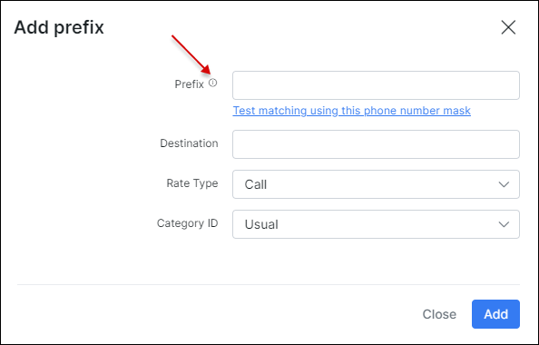
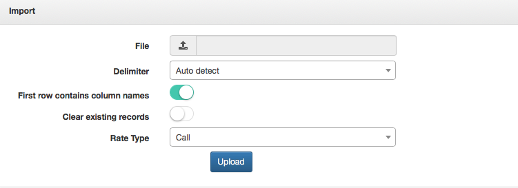

Prefixes
========

We added prefixes to Splynx to identify calls when the CDR is imported. We can also, import all prefixes from a .csv file.

Navigate to `Voice → Prefixes`, and click on the *Add* button located at the top right of the table:

The following parameters will have to be specified:

* **Prefix** - Add the prefix using the patterns from "Examples".

  You can use phone patterns to match phone number groups.
  Patterns are created  using special symbols.

  Examples can be found on the following page:
  [Examples.](voice/prefixes/examples/examples.md)

* **Destination** - Field to identify which type of destination this prefix will use, for example: international, fixed, mobile...etc.

* **Rate Type** - Select between Call, SMS or Data.

* **Category ID** - Select the category. This should've been added previously.

The second method is to use the import tool:

Simply click on the *import* button located at the top right of the table:

Then upload the file and specify the necessary parameters:

* **File** -  click to upload the file from your computer.

* **Delimiter** - select a delimiter, default (recommended) = Auto detect

* **First row contains column name** - enable this option if the first row contains your column names.

* **Clear existing records** - enable this to overwrite all existing prefixes.

* **Rate Type** - select between Call, SMS or Data.
