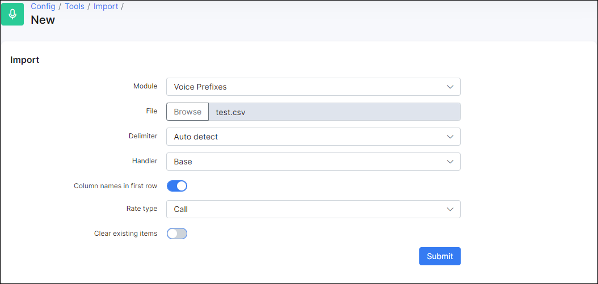
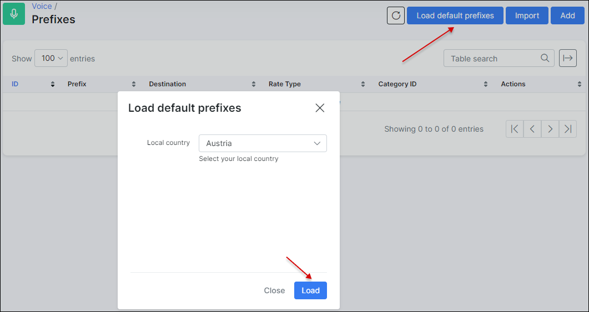

Prefixes
========

We added prefixes to Splynx to identify calls when the CDR is imported.

To add prefix(-es) manually, navigate to *Voice → Prefixes* and click on `Add` button located at the top right of the table:

The following parameters need to be specified:

* **Prefix** - Add the prefix using the pattern below:

#### Special symbols supported:

| Symbol      | Description                                                                       |
|-------------|-----------------------------------------------------------------------------------|
| `{!}`       | Zero or more any characters.                                                      |

---

#### Examples:

| Phone pattern        | Description                                                                             |
|----------------------|-----------------------------------------------------------------------------------------|
| `{!}`                | Any phone number                                                                        |
| `260{!}`            | Any phone number started from 260                                                       |

<icon class="image-icon"></icon> **IMPORTANT:** The previous complex patters, like `{x}` (one digit from 0 to 9), `{.}` (one or more any characters), `{n}` (one digit from 2 to 9) etc. are no longer supported in Splynx.

In case complex patters have already been used, it is necessary to change them.
*****************************************************************

* **Destination** - Field to identify which type of destination this prefix will use, for example: international, fixed, mobile, etc;

* **Rate Type** - Select between Call, SMS or Data;

* **Category ID** - Select the category. The categories must be added earlier in *Voice → Categories*.

We can also import all the prefixes from a ***csv*** file:

Simply click on *Import* button located at the top right corner of the table:

Then upload the file and specify the necessary parameters:

* **File** -  click to upload the file from your computer;

* **Delimiter** - select a delimiter, default (recommended) = Auto detect;

* **Handler** - select between Base or other External handlers 

* **Column names in first row** - enable this option if the first row contains your column names;

* **Rate Type** - select between Call, SMS or Data;

* **Clear existing items** - enable this toggle to overwrite all the existing prefixes.

Also, it is possible to `Load default prefixes` for a predefined country:

