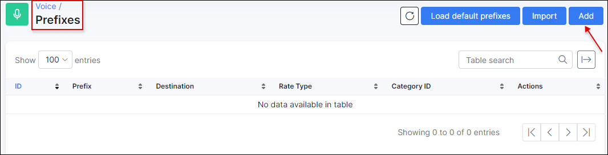

Prefixes
========

We added prefixes to Splynx to identify calls when the CDR is imported.

To add prefix (-es) manually, navigate to `Voice → Prefixes` and click on the *Add* button located at the top right of the table:

The following parameters will have to be specified:

* **Prefix** - Add the prefix using the pattern from *Examples*;

  You can use phone pattern to match phone number groups.
  Pattern is created  using special symbol.

  Examples can be found on the following page:
  [Examples.](voice/prefixes/examples/simplified_prefixes_example.md)

* **Destination** - Field to identify which type of destination this prefix will use, for example: international, fixed, mobile, etc;

* **Rate Type** - Select between Call, SMS or Data;

* **Category ID** - Select the category. The categories must be added earlier in `Voice → Categories`.

We can also, import all prefixes from a *.csv* file.:

Simply click on the **Import** button located at the top right corner of the table:

Then upload the file and specify the necessary parameters:

* **File** -  click to upload the file from your computer;

* **Delimiter** - select a delimiter, default (recommended) = Auto detect;

* **Column names in first row** - enable this option if the first row contains your column names;

* **Rate Type** - select between Call, SMS or Data;

* **Clear existing records** - enable this to overwrite all existing prefixes.

Also, it's possible to `Load default prefixes` for predefined country

