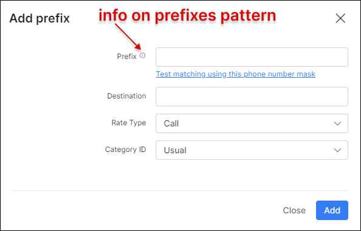

Prefixes
========

We added prefixes to Splynx to identify calls when the CDR is imported. We can also, import all prefixes from a .csv file.

Navigate to Voice → Prefixes, click on add.

Complete the fields.

* **Prefix** - Add the prefix using the patterns from "Examples".

  You can use phone patterns to match phone number groups.
  Patterns are created using special symbols. [Examples.](voice/prefixes/examples/examples.md)

* **Destination** - Field to identify which type of destination this prefix will use, like international, fixed, mobile...etc.

* **Rate Type** - Select Call, SMS or Data.

* **Category ID** - Select the category. Should've been added previously .

The second method is to use the import tool.

