Processing
==========

Voice CDR processing is managed here. We can import a CDR to charge customers and print the register of calls within their invoice.

Within the processing module there are 4 menus, CDR Import, CDR Export, CDR History and CDR errors.

### CDR Import

To import a CDR, you simply just upload the file, select a delimiter, enable/disable first row contains column names, select the type and the handler(By default the Handler used is Base). Provider is not needed

Once the upload is complete, select the correct fields in every column, and then click on preview to check if all is working as expected.

If the system does not show any alert then click on import and check that all is accepted.

Then you will be able to view customer's calls, sms and data used on their statistics tab.

### CDR Export

It is also possible to export the same data that we insert/import to Splynx, to a new CDR, filtering by period and voice type.

### CDR History

In CDR history, we can check the register of imported CDR's, download them or delete them in case something was wrong or missing. If you delete a CDR the information imported will be also deleted.

### CDR errors

After importing CDR's, this section will give you an overview of any errors that may have occurred while processing, with actions available to operate with the errors.

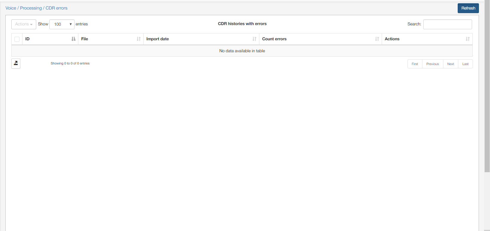

For example:

An import was performed and completed with errors

You can review these error in `Voice / Processing / CDR errors`

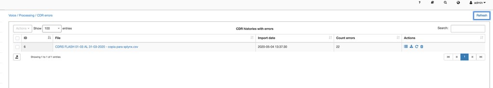

In the Actions column, you can choose to view the errors, download the CDR, reprocess or delete the file. Below is an example of viewing an error:

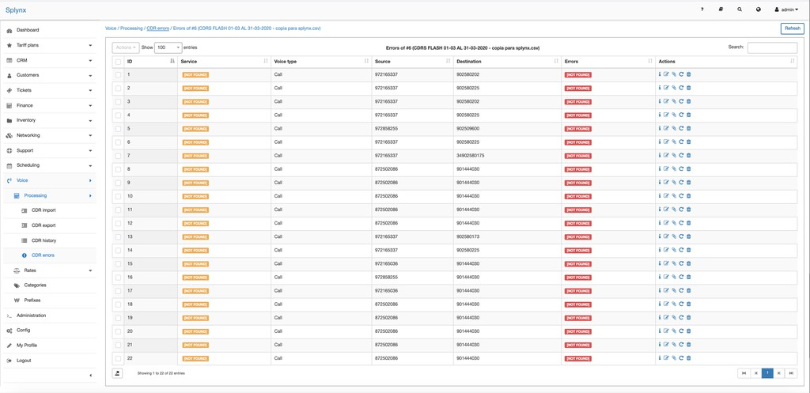

You can interact with each entry within the error with the tools provided in the actions column. The tools in the actions column allow you to view detailed info about the error, update the CDR record, pair the CDR record to a service, reprocess or delete the record.

There could be a number of reasons for errors while importing CDR's and the tools provided in the CDR errors section are there to help fix these errors you may have encountered.

In this example we've encountered an error stating that the records have no service or customer associated.

An example of reprocessing an error:

1. Error reads that no service was found in each entry.

Select all entries to perform a bulk action:

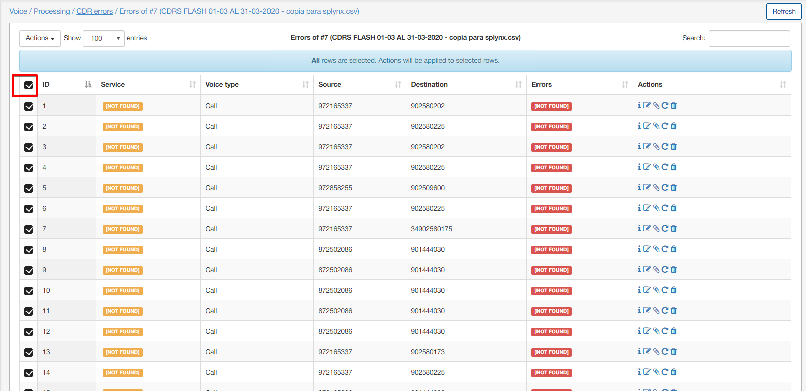

Click on the actions button on the top of the list and select pair:

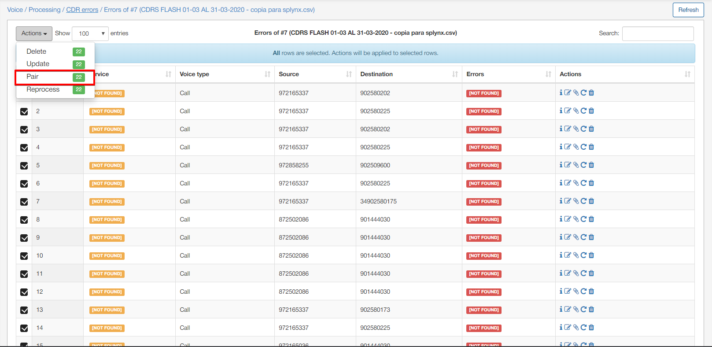

Enter the service ID to find, to use to pair to the CDR records and click on find:

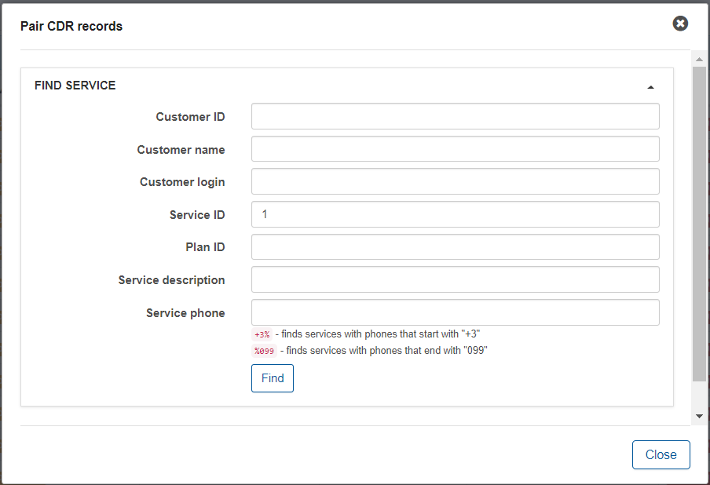
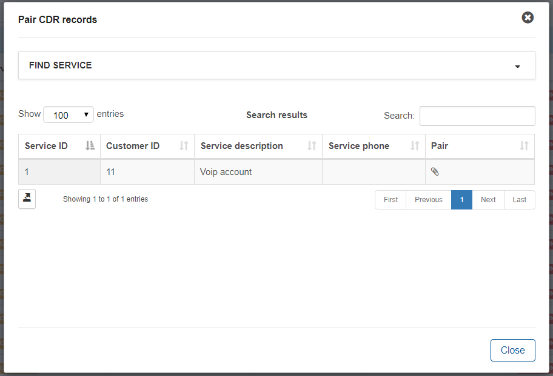

Then click on the pair icon and confirm the action:

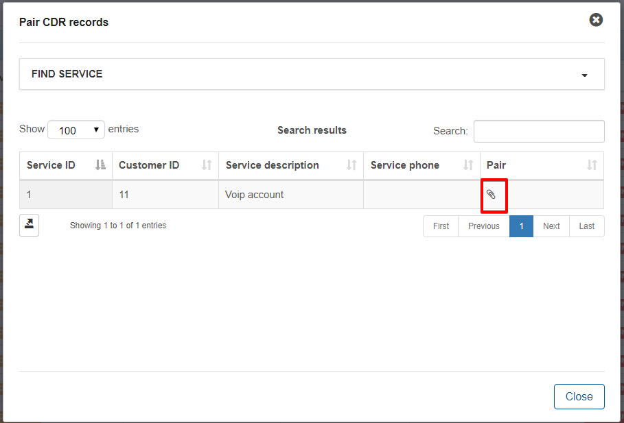
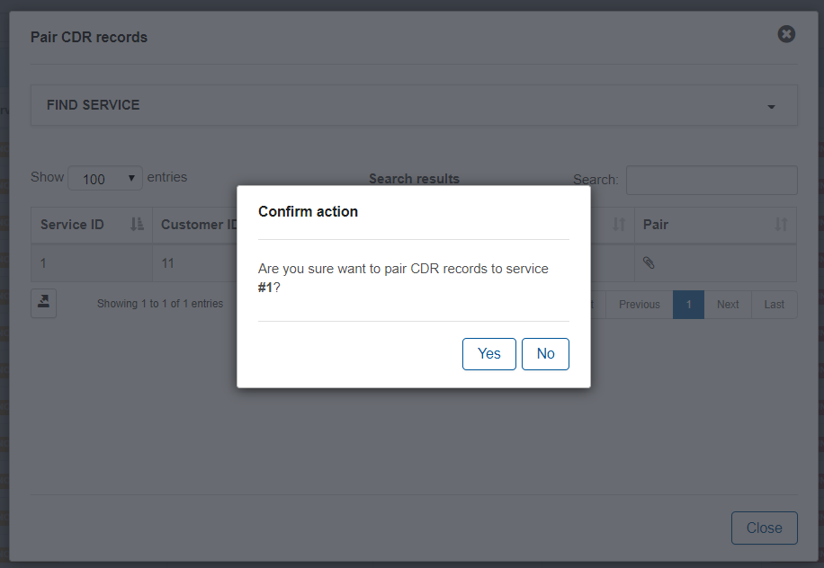

After confirming, each entry will be paired to the service and there will be no more errors.

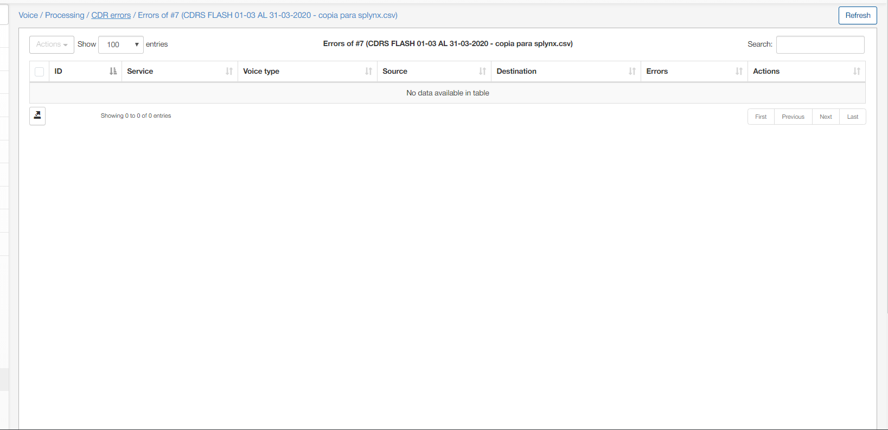

2. Error states no customer could be found with this number:

Navigate to the respective customer and ensure the number is present in his service and if it is not, please fill it in:

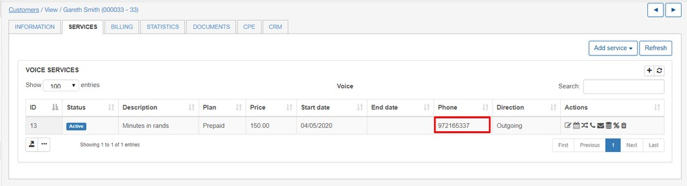

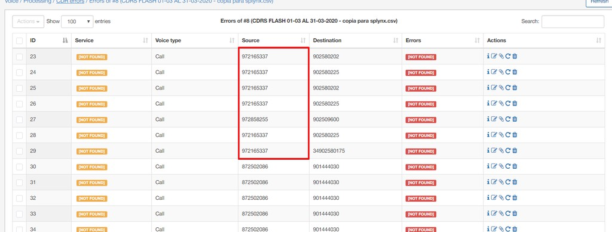

Navigate to `Voice / Processing / CDR errors` , view the errors:

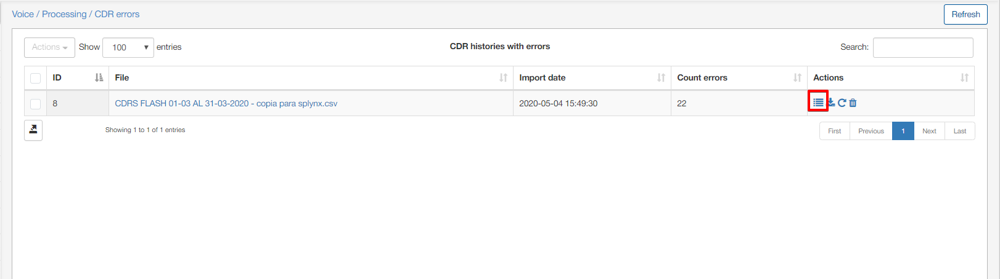

Select all entries to perform a bulk action:

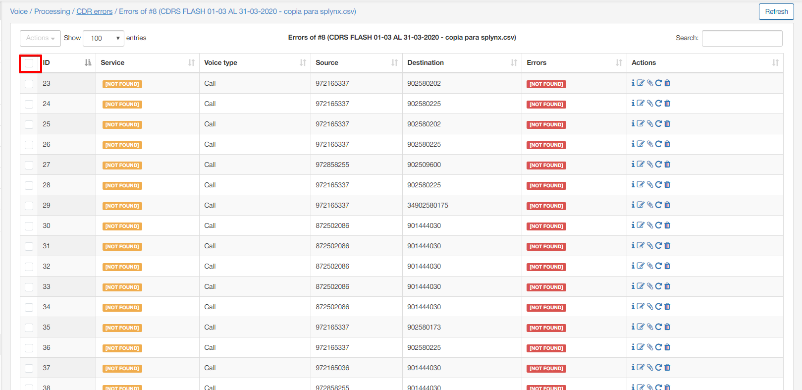

Click on the actions button on top of the table and select the reprocess option and confirm the action:

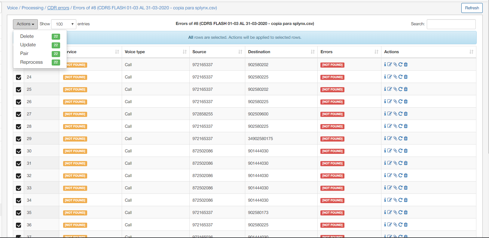
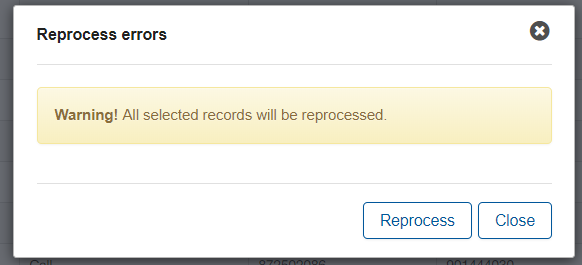

The system will then reprocess the CDR record and match the number to the customer. You will see that the total number of errors will decrease depending on how many entries were fixed in the reprocessing of the CDR.

Before the adding the number to the customer and reprocessing, there were 22 errors. After adding the number to the customer and reprocessing there are only 14 entires left to be fixed:

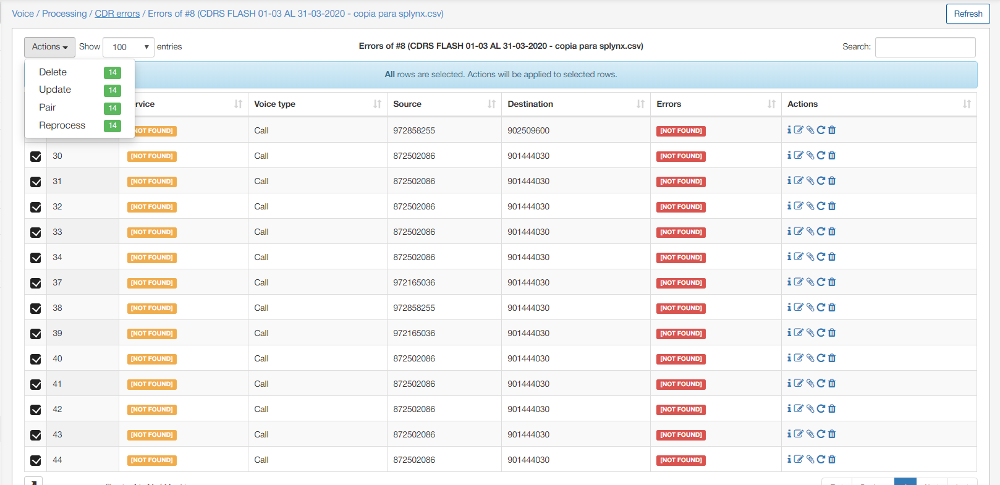

The same process can be used again to fix the outstanding entries.
