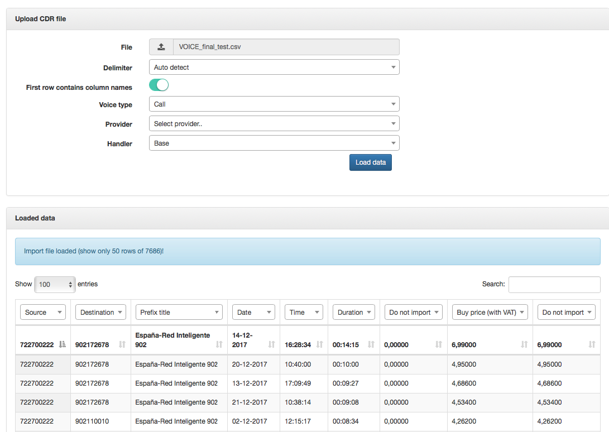
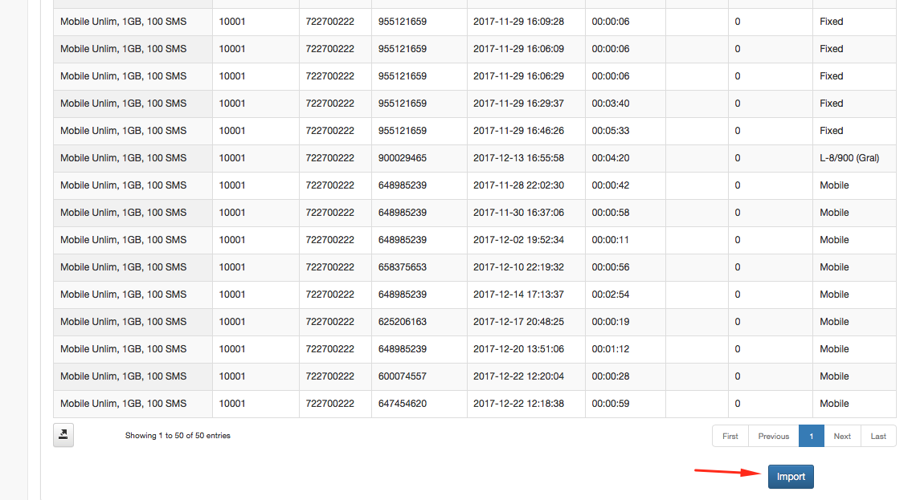
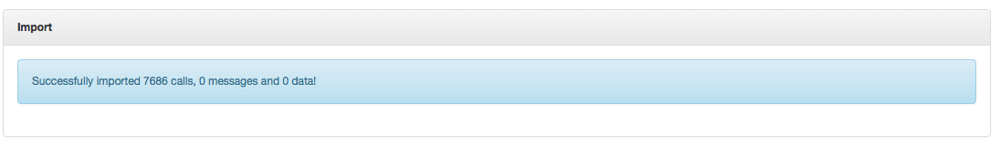
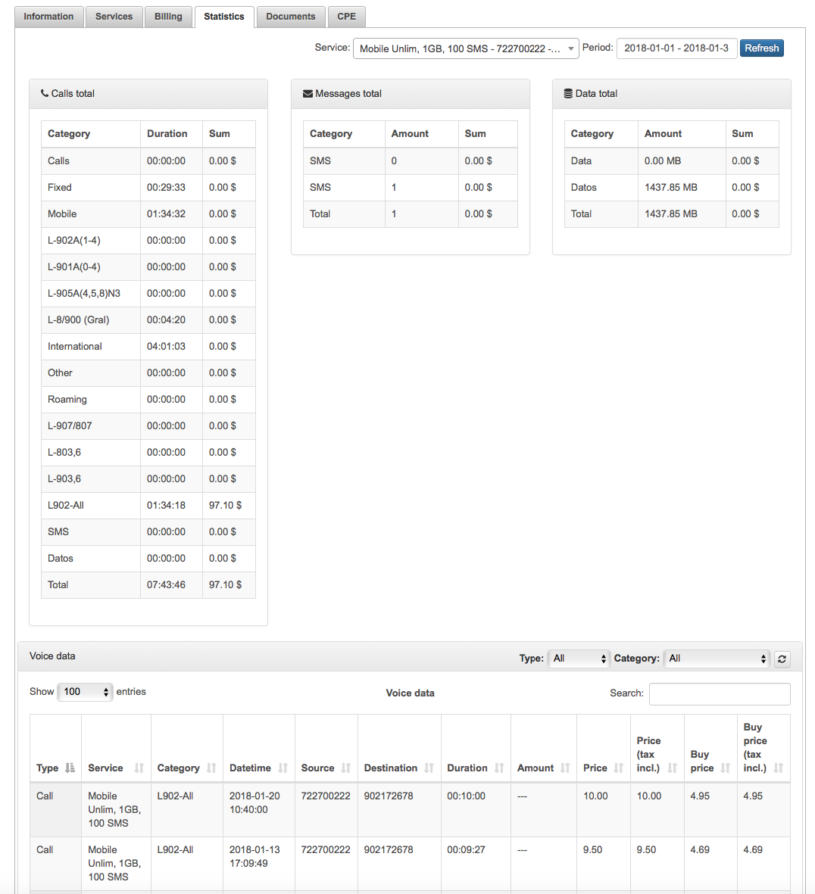

Processing
==========

Now the Voice CDR processing is managed here. We cand import a CDR for charge the customer and print in his invoice the register of calls.

Behind the processing menu there are 3 other pages, Import CDR, Export CDR and History CDR.

### Import CDR

To import the CDR you have just to upload the file, select delimiter, enable/disable first row contains column names, and select type and handler(By default use Handler Base). Provider is not needed

Once is load, select the correct field in every column, and then click on preview to check if all is working fine.

If the system don't shows any alert then click on import and check that all is accepted.

Then customers on statistics will be able to see their calls, sms and data used.

### Export CDR

It's also possible to export the same data that we introduce to splynx to a new CDR, filtering by period and voice type.

### History CDR

In the history, we can check the register of CDR imported, dowload them or delete in case that something was wrong or missed. If delete the CDR the information impoted will be also deleted.

<<<<<<< HEAD

=======

>>>>>>> 3e28cdfb12e007abd7211a2a0ff4f31be12f3edf
