CDR processing
==========

You can import a CDR (in .csv format) file, which can be used to charge customers via their invoice which will show the register of calls, messages and/or data.

Within the processing module there are 4 menus, CDR Import, CDR Export, CDR History and CDR errors:

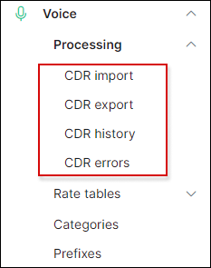

### Import CDR

To import a CDR file you have to upload the file (in .csv format), select the delimiter, enable/disable “first row contains column names”, select the voice type (call, messages, data or mixed) and select the handler ( default handler = "Base"). Provider selection can be skipped.

*PLEASE NOTE! Every client has a different type/structure of CDR files, so if the Splynx base handler can't process your file because of another format, you can send a request to the Splynx Support team to develop a custom handler for your type of CDR files. Please send 2-3 CDR files as examples and a full description (which field should be imported, which field should be ignored etc.). The custom handler development takes a few business days, however it remains a free service.*

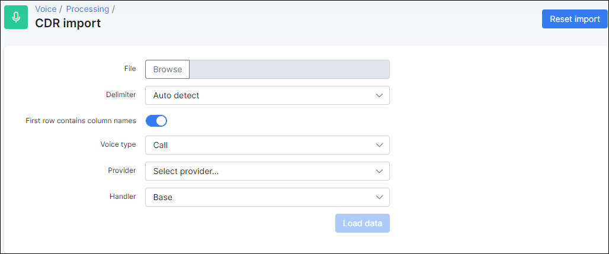

Let's import a CDR file with a few calls.

Here we have a CSV file with 3 calls in a simple format:

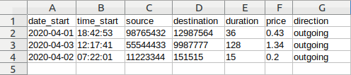

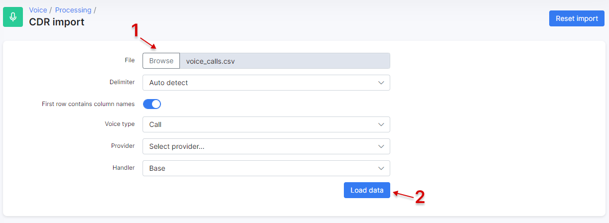

If you have any messages or data records in the CDR, other appropriate columns should be selected.

*Regarding incoming calls - if your CDR file contains incoming calls, the appropriate voice service must be created for a customer: with "direction" = incoming, and "phone number" = Destination number from the file (or a pattern like 123{!} - means all phone numbers beginning with 123)*

Once the data has been loaded, selected the correct value in every column(step 3), and then click on preview (step 4) to preview the output results:

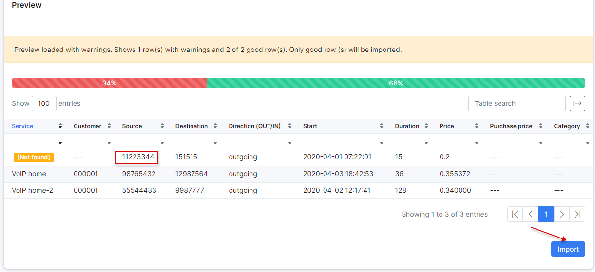

The preview shows 1 error because the service was not found. The next 2 calls were imported as the customer has 2 voice services with the appropriate phone numbers:

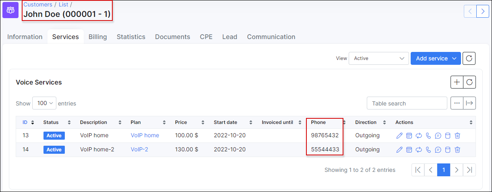

We will import the 2 calls in the mean time and reprocess the error at a later stage after fixing the issue:

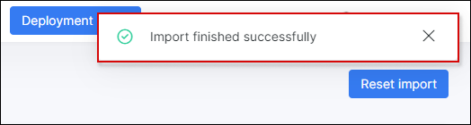

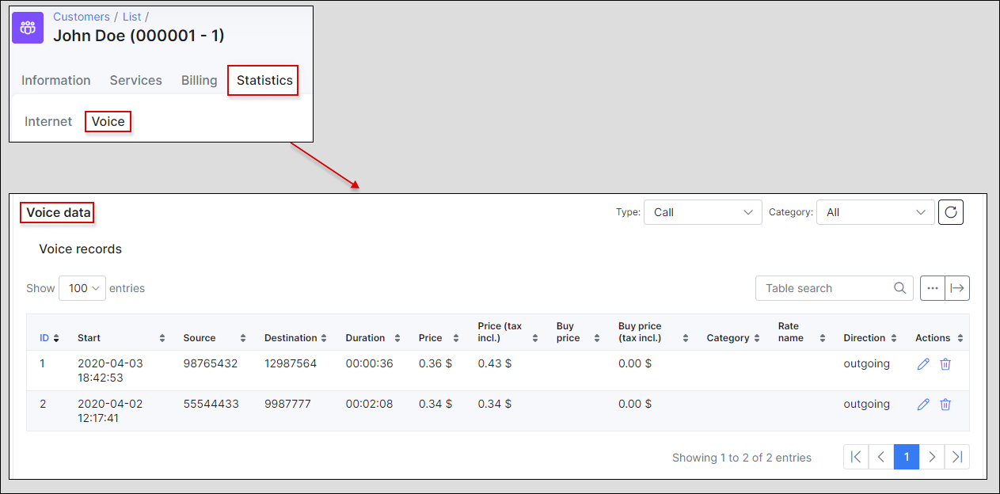

Now let's view and fix the CDR errors:

 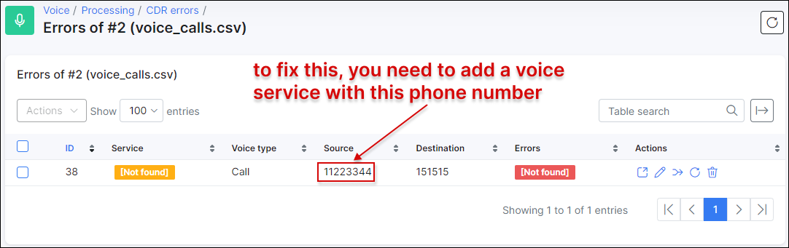

In order to allow Splynx to link the CDR to the correct phone number and in turn with the correct customer, we have to create a voice service for the customer with the "Source" number as the "Phone number" in the customer's service:

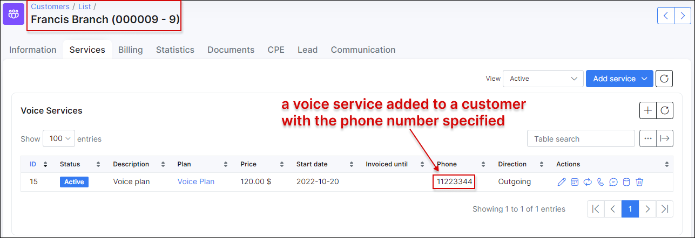

Now we can reprocess all the errors:

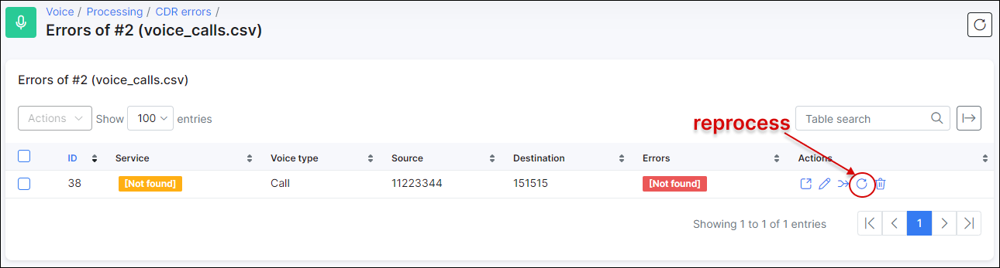

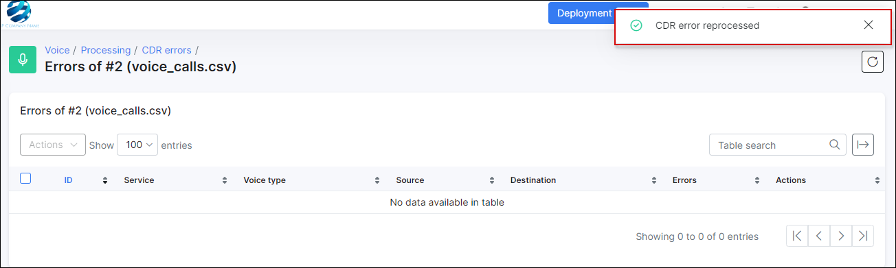

Now that we have reprocessed the error, we can view the voice statistics in the customer’s page:

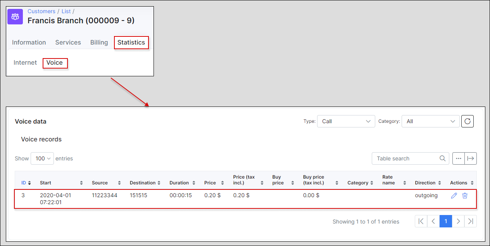

If you are using voice categories in Splynx, and you have a category name for every call in the CDR file, this name should be changed to the category ID (under Voice/Categories), the name of a category can be detected and imported using a custom handler(our support team can develop it for you).

### Export CDR

We can also export the same data that we have imported to Splynx, to a new CDR, filtering by period and voice type.

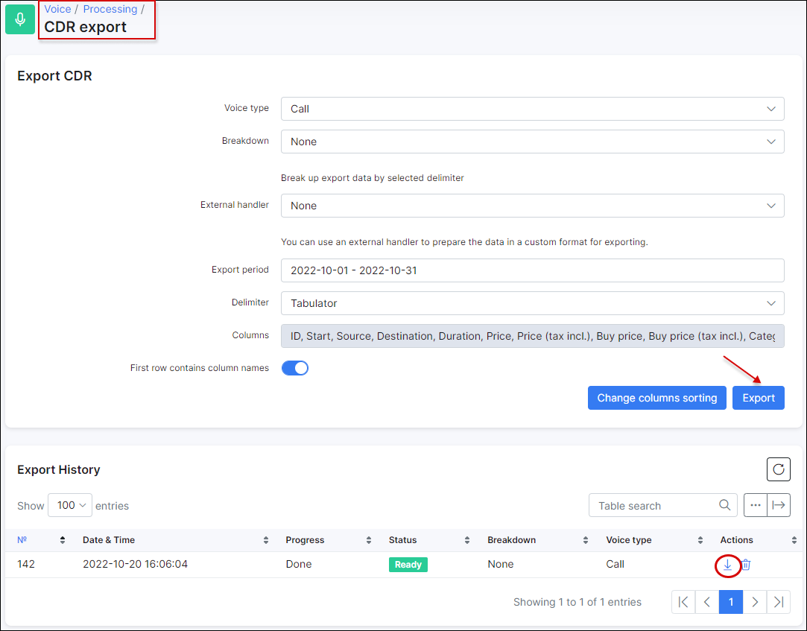

After generating the file, you can download an archive with the CSV file that will contain all the call records.

### History CDR

In the CDR History module, we can view the log of all CDR records imported, download them or delete them in case there is an error or some details were missed. If an historic record is deleted, all the information (calls, data, messages) it contains, will be also deleted.

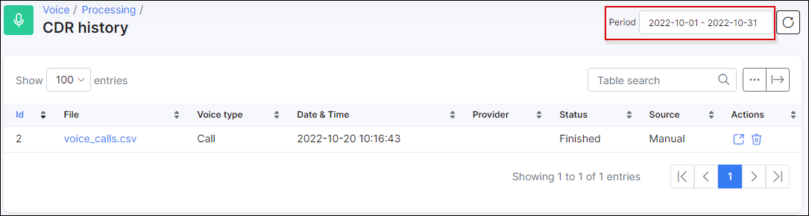

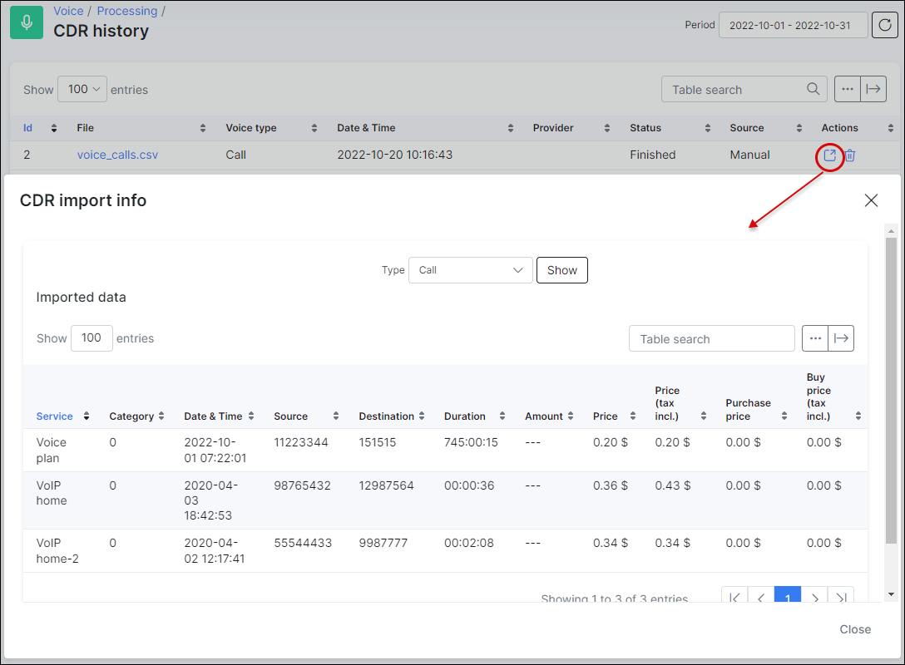
