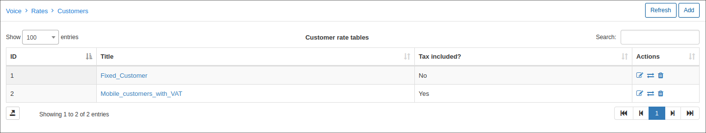
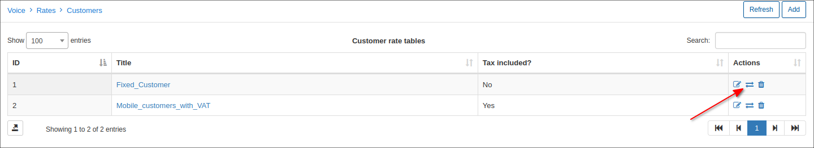
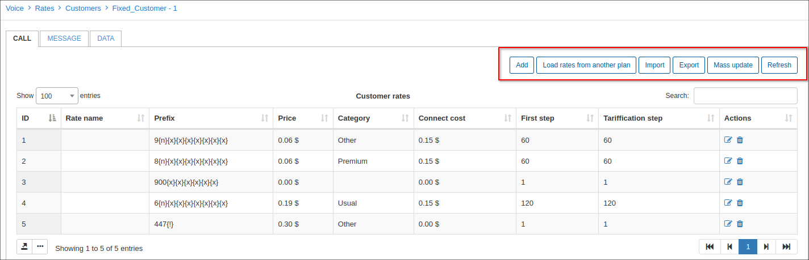
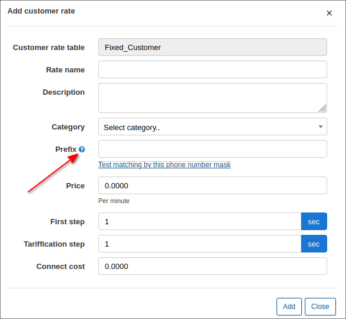
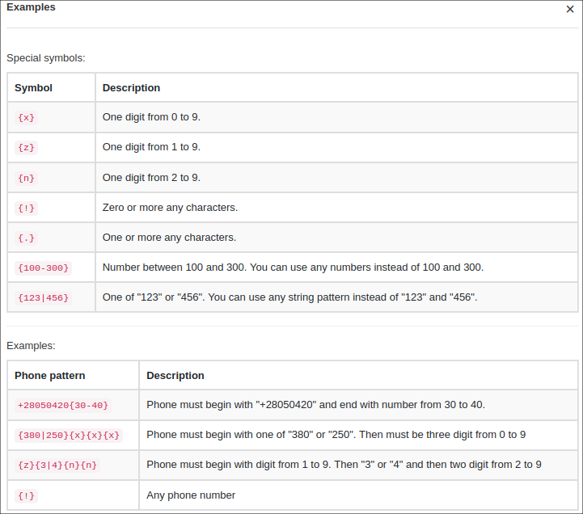
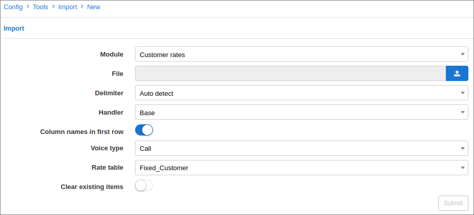
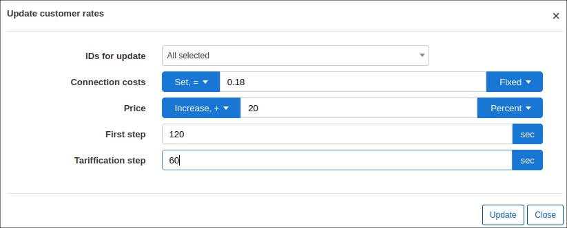

Rates
=====

In the Rates tables, we associate prices with prefixes and categories. It's divided in Customer rates and Provider rates. Customers rates refer to sell prices, and Provider rates, buy prices. You can manage it using only one of both customer and provider rates.

Navigate to Voice → Rates → Customers/Providers and click on add.

Once it is created, click on the icon <icon class="image-icon"></icon> to config the rates.

We can add them manually or import them. Mass updates are also possible.

Add customer's rate

* **Category** - Category associate to this prefix.

* **Prefix** - Prefix for configuring the price, you can follow these steps to type it:

* **Price** - Price per minute.

* **First step** - Duration of the first step.

* **Tariffication step** - Duration of the tariffication step.

* **Connect cost** - Price for connecting the call.

We can also import from a .csv file.

And make mass update.

* **IDs for update** - All IDs we want to update.

* **Connection costs** - Update the connection cost, by Set,= / Increase / Decrease , a percentage or a fixed price.

* **Price** - Update the price, by Set,= / Increase / Decrease , a percentage or a fixed price.

* **First step** - Duration of first step.

* **Tariffication step** - Duration of tariffication step.
