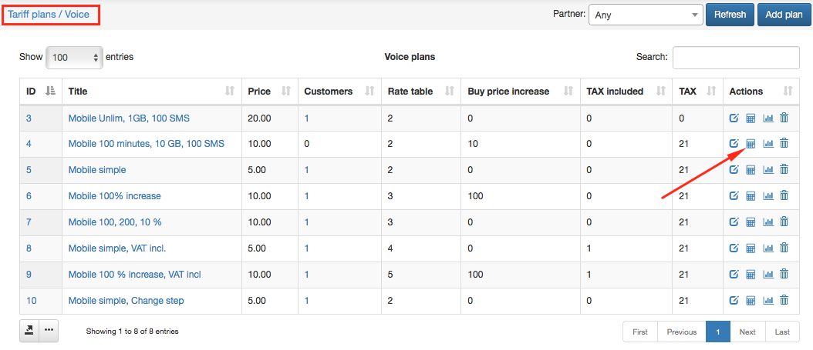
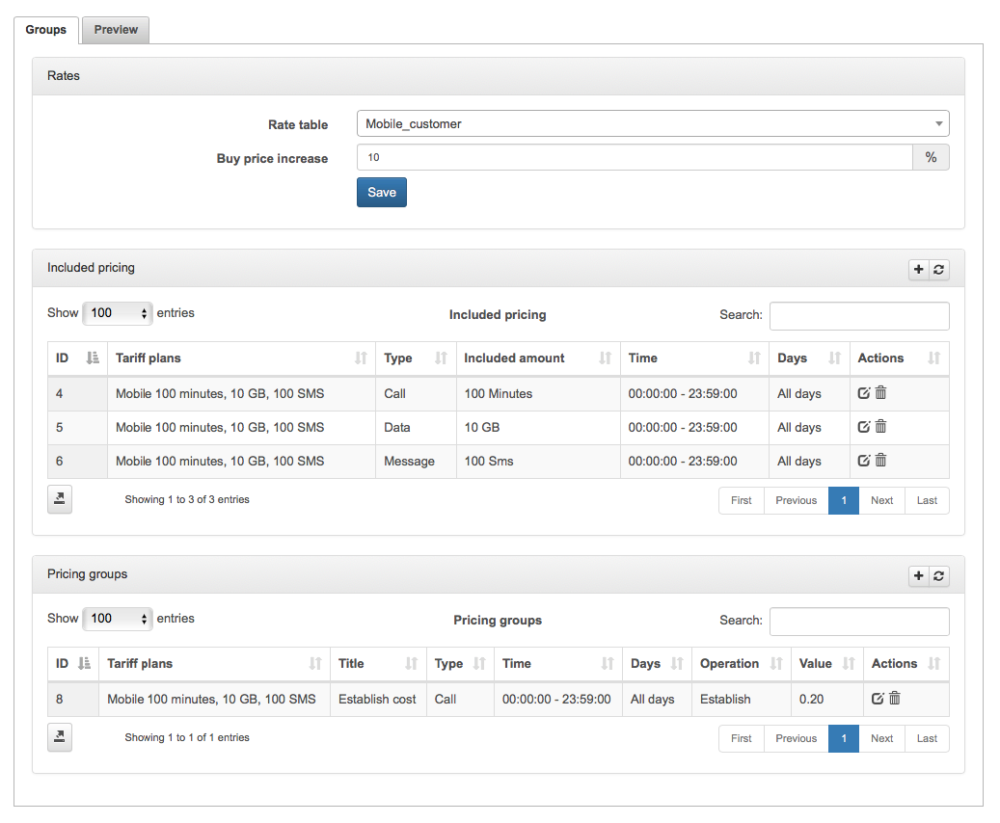
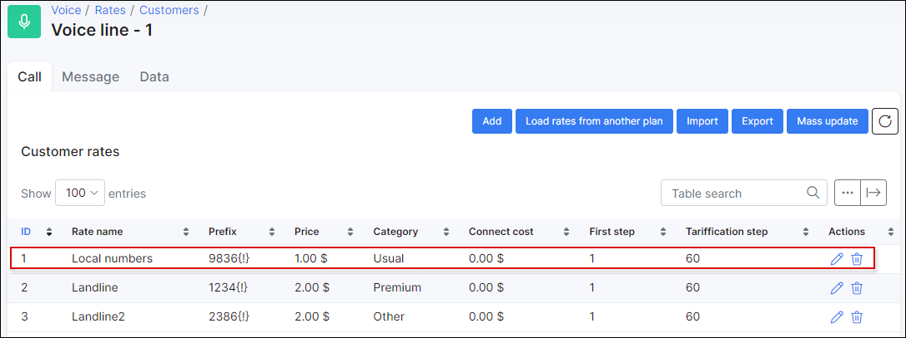
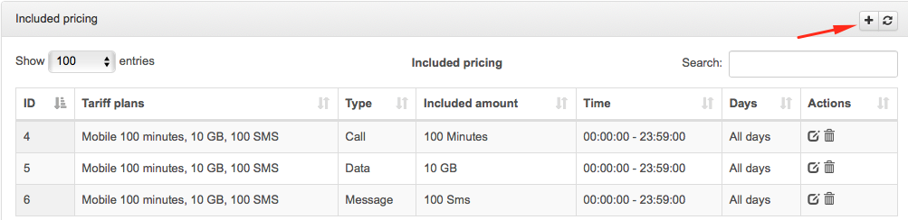
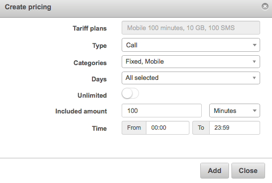
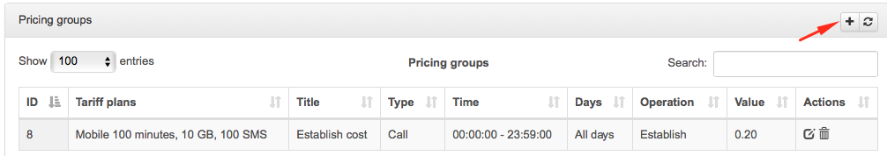
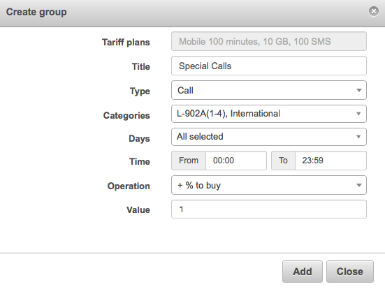
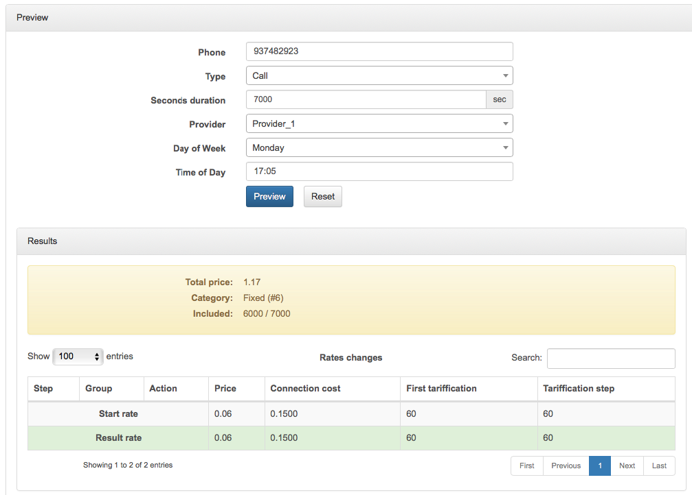

Tariff Settings
===============

We have introduced settings in the tariffs configurations, which allows you to add included pricing and group pricing to the tariff, and also a preview tool for testing purposes. You also have the option to choose which rate table the tariff will be based on and to conveniently manage buy prices(prices from providers), we've added the ability to add an increase percentage to define the final sell prices.

Navigate to `Tariffs Plans → Voice`, and click on the pricing icon <icon class="image-icon"></icon> to configure the tariff settings.

Here you will be presented with 2 windows: Groups and Preview.

On the Groups window, we have 3 sections. In the first one we have to set the Rate table and the Buy price increase in %.

In the second one, we can add the included pricing.

* **Type** - Type of the pricing, could be Call, SMS or Data.

* **Categoires** -  We have to choose to which categories are included in this price. We should always create categories and prefixes first.

* **Days** - Select days of the week to be included.

* **Unlimited** - Enable this option if it is not limited by minutes.

* **Included amount** - Select amount of time for calls(in seconds, minutes or hours), nº of messages or amount of data(in B, KB, MB or GB).

* **Time** - Period when this pricing included is applied.

In the last section, we can configure pricing groups. For example, if we want to manage any category in a different way or if we want to add something specific.

* **Title**  - Title of the Group pricing.

* **Type** - Type of the pricing, could be Call, SMS or Data.

* **Categoires**  -  We have to choose to which categories are assigned to this price . We should always create categories and prefixes first.

* **Days** - Select days of the week to be included.

* **Time** - Period when this included pricing is applied.

* **Operation** - + % to buy, + % to sell, Establish, Tarification Step, First tarification.

* **Value** -  + % to buy, + % to sell → increase percentage of price. Establish, Tariffication Step, First tariffication → Price.

####Preview Tool

We can set an example of consumption to test if our settings and configs are working as expected.

The preview is showing that only 6000sec(100min) is included, and as we have set 7000sec, the other 1000 seconds will be charged based on the table, so total price is 1'17, that corresponds to our config in the Rate table selected.
