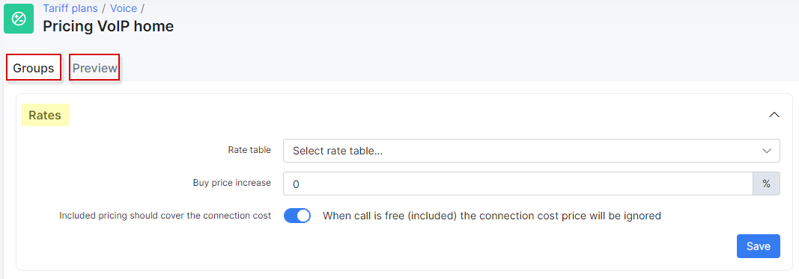
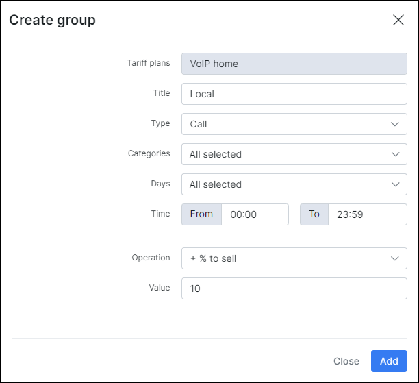
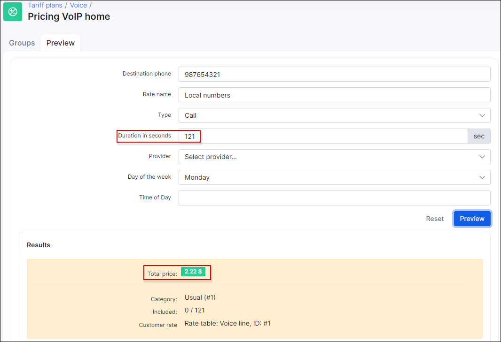

Voice tariff settings
===============

We have introduced settings in the tariff configuration which allows you to add included pricing and group pricing to the tariff, and also a preview tool for testing purposes. You can choose which rate table the tariff will be based on and to conveniently manage prices from providers. We've added the ability to add an increase percentage to define the final sell prices.

Navigate to `Tariff Plans → Voice`, and click on the "Pricing" icon to configure the tariff settings:

Here you will be presented with 2 tabs: Groups and Preview. Under groups tab you can configure rates settings, add some included pricing also configure some pricing groups.

### Rates

Under rates settings you can select rate table, set % which will be added to buy price (provider rates) and define if the connection price will be ignored or no. If you are using rates, each voice plan should be configured with a rate table to understand how to calculate the price of a call/message/data. You should use "Buy price increase" field in case of using provider rates. In this field, you can set static % of markup. Let's say you have a provider rate with a buy price 0.1$ (you pay it for voice provider) and you want to add 50% markup to this rate to have some profit. In this case, Splynx will calculate rate for customer in this way: 0.1$ + 50% what equal to 0.15$ - this is a price of a customers rate.

### Included pricing

Under included pricing window we can define some limits like minutes for calls, amount of SMS and amount of MB for data.

Let's say I want my customers to have 600 minutes for free per month. In this case we can add a new entry for included pricing:

Here we can define next options:

* **Type** - Type of the pricing, could be Call, Message or Data;

* **Categories** -  We have to choose to which categories to include in this price. We should always create categories and prefixes first;

* **Days** - Select days of the week to be included;

* **Unlimited** - Enable this option if it is not limited by minutes;

* **Included amount** - Select amount of time for calls (in seconds, minutes or hours), amount of messages or amount of data (in B, KB, MB or GB);

* **Time** - Period when this included pricing is applied.

### Pricing groups

In the last section, we can configure pricing groups. For example, if we want to manage any category in a different way or if we want to add something specific.

* **Title**  - Title of the Group pricing;

* **Type** - Type of the pricing, can be Call, SMS or Data;

* **Categoires**  -  We have to choose to which categories are assigned to this price . We should always create categories and prefixes first;

* **Days** - Select days of the week to be included;

* **Time** - Period when this included pricing is applied;

* **Operation** - + % to buy, + % to sell, Establish, Billing block, Minimum duration;

* **Value** -  values for the Operation options.

## Preview Tool

A useful tool where you can test and preview a recently configured pricing.

Here you need to define a destination phone number and call duration and click on preview. This will return a price of this call in according to rates. We have created rates previously:

Let's change the duration and see what we have:

