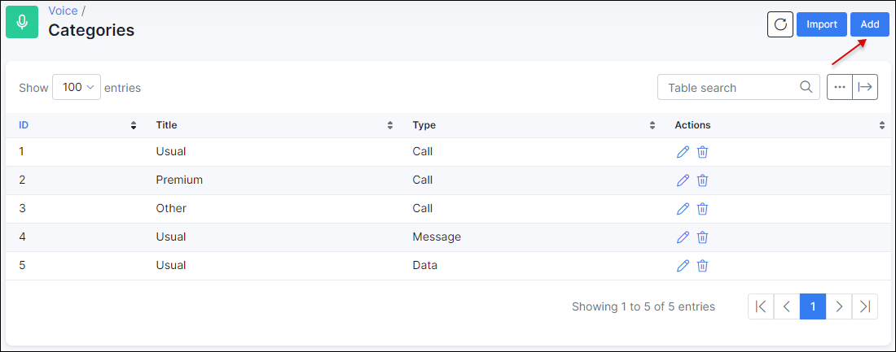
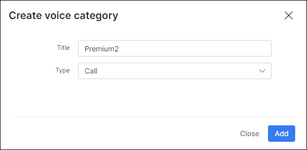
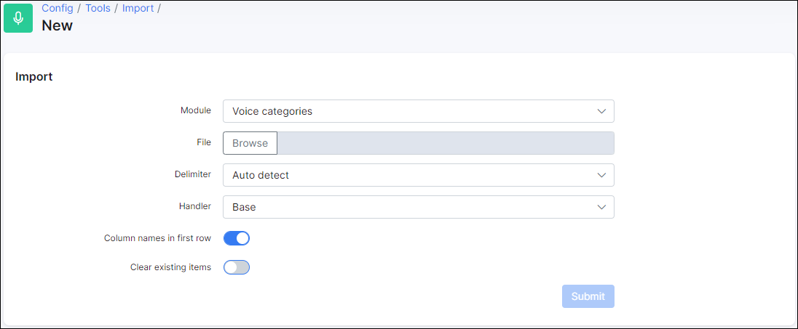

Voice Categories
================

We use categories, for associating prices and prefixes to them, and be able to configure the included pricing and the pricing groups.

Go to `Voice → Categories` and click on add.

Complete the fields:

* **Title** - Title of the category.

* **Type** - Select if it is Call, Message or Data category.

It is also possible to use the import tool to add categories from a .csv file.

